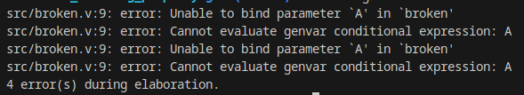
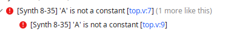
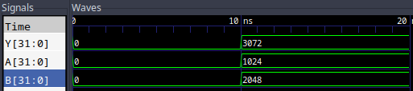
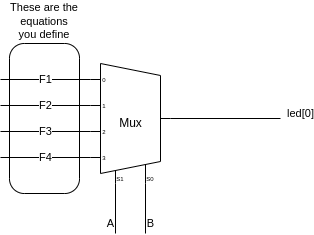

= A Note On Your Behavior(al Verilog)
:source-highlighter: highlight.js
:highlightjs-languages: verilog
:icons: font
:toc:

This lab is going to open the Pandora's Box of Behavioral Verilog. I say Pandora's Box because behind this door is all of the extremely cool, yet extremely complicated structures within FPGAs and digital logic in general.

Let's start by revisiting the pain you had to endure doing the multi and demultiplexers in the previous lab:

[source,verilog]
----
include::src/problem.v[lines=3..]
----

This was obviously a pain since chaining together the conditional/ternary operators was an error prone and non-obvious way of constructing these multiplexers. I would guess that your initial ideations were to use something like a `case/switch` or `if/else` structure like you might see in other programming languages. However, if you had tried something like this:

[source,verilog]
----
include::src/broken.v[lines=3..]
----

Then you would find that it doesn't synthesize at all. In fact, Icarus Verilog gives us the following error:

.I didn't even know we were trying to bind?

and Vivado says:

.Not a constant?!

Obviously, something is wrong here. Let's introduce the protagonist of this lab:

== Behavioral Verilog

Prior to this lab, we have been describing things in Structural Verilog, very specifically calling out gates, assignments, etc to build the physical structure of the circuits we are programming onto the FPGA. There's another paradigm, though, that is more commonly used.

Just as a higher level programming language can save a developer time by handling minutia for them, Behavioral Verilog can reduce the cognitive burden of synthesizing digital circuits. However, with great power comes great responsibility. Just as a higher level language can mask really bad design decisions, or lead to complicity in the programmer -- so too can Behavioral Verilog. That is why we start teaching structural, so you understand the underlying concepts to which the FPGA synthesizes.

With that disclaimer out of the way, let's see how we actually write this fanciful "Behavioral Verilog"

=== The Always Block

The key structure used in Behavioral Verilog is that of the `always` block. It elevates the concepts of continuous assignment to an _event driven_ way of thinking.

NOTE: Things aren't _actually_ event driven like you would imagine in a piece of software. This is only used as a hint to the Verilog synthesis tools.

Let's see this in action:

[source,verilog]
----
include::src/basic_behavioral.v[lines=3..16]
----

<1> Note the `always` block. This notes the signals this block is interested in.
<2> We can use if statements!
<3> DO NOT forget to use `reg` in the Output declarations! We will cover exactly what this means and entails in a future lab about synchronous logic. For now, just know that `reg` means "I can assign to this without ``assign``"

=== The Sensitivity List

No, it isn't things you can say to upset the Synthesizer, instead it is a list of signals for which changes *can* result in changes to the outputs of the always block. Any signals set in the always block count as its outputs. In the case of our above example, we can see:

[source,verilog]
----
include::src/basic_behavioral.v[lines=10]
----

<1> We only list for changes to (know as "at" or @) the signal A.

Any signals not in this list will not be taken into account as driving changes, but we will dive more into that on the lab covering synchronous logic.

=== New and Improved Multiplexer!

With this new behavioral knowledge in hand, we can explore what a possible implementation of a multiplexer in Behavioral Verilog could look like:

[source,verilog]
----
include::src/behavioral.v[lines=3..24]
----

<1> Again, note the `reg` specifier in the data type
<2> You can shorthand a `*` into the sensitivity list for "all signals"
<3> WOAH! An `if` statement! this works exactly like other languages, albeit with extremely frustrating syntax.
<4> Case statements are also possible. We will use these very extensively when we cover state machines in the future.
<5> Note, no use of `assign` here. We are now using behavioral syntax, and `reg` types do not need `assign`.

CAUTION: This does not execute in any given order, like a program would, but rather describes a physical circuit so happens "all at once".

Comparing this with the initial implementation, the intended behavior is not only clearer to see, but much easier to write and maintain. As a quick teaser, you can do a lot more than that, see below:

[source,verilog]
----
include::src/teaser.v[lines=3..12]
----

<1> Note: because this is only one line _in the block_ you do not need begin and end

And the output from the above source code:

.Adder Output

You have a great deal of power and responsibility when using this. Knowing the side effects and taking care to watch FPGA utilization are _critical_ to becoming successful RTL engineers.

== Back to Multiplexers

We covered multiplexers in the previous lab, however only at a very surface level. Typically, their discrete and intentional use is almost exclusively as bus switches in computer systems, both multiplexing data *onto* as well as *off of* internal busses to the CPU.

However, there's a very solid theoretical use case devised by Claude Shannon based on the work of George Boole (yes, that ``bool``e), showing that any arbitrarily complicated binary equation can be _decomposed_ into smaller sets, hooked together with multiplexers. Now, obviously, that explanation alone is not nearly sufficient to show you what we're talking about, so let's go through an example.

=== Shannon's Decomposition

Given a truth table as shown below:

include::starting_truth_table.adoc[]

We can note that there are two discrete states, easily visible in the most significant bit, A. First, the four beginning rows where A is zero, and second the four rows where A is one. If we simply *decompose* this function into two, we can state the following:

.Three Variable Decomposition
====
`F(A, B, C) = ~A & F1(0, B, C) | A & F2(1, B, C)`
====

Here are the truth tables:

include::a_is_zero.adoc[]

include::a_is_one.adoc[]

Where `F1` is the first four rows, dependent on now only B and C, and `F2` being the last four rows, dependent now only on B and C. We can say that they are only dependent on B and C because throughout their entire truth tables, only B and C change. From here, we can solve two 2-variable KMaps to derive `F1` and `F2`:

.F1 and F2 derived equations
====
* `F1 = (~C | B)`
* `F2 = (B | C)`
====

This lets us do something quite fascinating. We can take A and use it to drive the select line of a 2-input MUX:

image::img/shannons_mux.drawio.png[]

See, that we have taken `F1` and piped it into the 0 input of the MUX, to show that we want the output from that equation when A is zero, then the `F2` function and piped it into the 1 input for the same reason. This achieves that "or" functionality shown above.

You can now further decompose each `F1` and `F2` on B, then *again* on those outputs from C. This leaves you with a 8-input (3-bit) MUX with the inputs tied to `0` or `1` based on the rows in the truth table. It can also be shown as three two-input MUXes chained together, one for each of the three decompositions. You can always decompose to an 2^N^ input MUX, or an N bit MUX where N is the number of variables in your truth table.

== Lab Deliverables

Given the following truth table:

|===
| A | B | C | D | Y
| 0 | 0 | 0 | 0 | 0
| 0 | 0 | 0 | 1 | 1
| 0 | 0 | 1 | 0 | 0
| 0 | 0 | 1 | 1 | 1
| 0 | 1 | 0 | 0 | 0
| 0 | 1 | 0 | 1 | 1
| 0 | 1 | 1 | 0 | 1
| 0 | 1 | 1 | 1 | 1
| 1 | 0 | 0 | 0 | 0
| 1 | 0 | 0 | 1 | 1
| 1 | 0 | 1 | 0 | 0
| 1 | 0 | 1 | 1 | 1
| 1 | 1 | 0 | 0 | 0
| 1 | 1 | 0 | 1 | 1
| 1 | 1 | 1 | 0 | 0
| 1 | 1 | 1 | 1 | 1
|===

Decompose twice and implement using a 4-input MUX designed with behavioral verilog. Use the I/O Table below:

|===
| Signal   | Purpose | Direction
| `sw[0]`  |   D     |  IN
| `sw[1]`  |   C     |  IN
| `sw[2]`  |   B     |  IN
| `sw[3]`  |   A     |  IN
| `led[0]` |   Y     |  OUT
|===

NOTE: Write out the truth tables for each of your `Fn` functions and do decomposition on the most significant bits. Make sure your bit order is correct when wiring up to the MUXes.

Your final structure should look something like this:

.Structure of Solution
