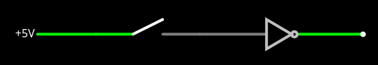
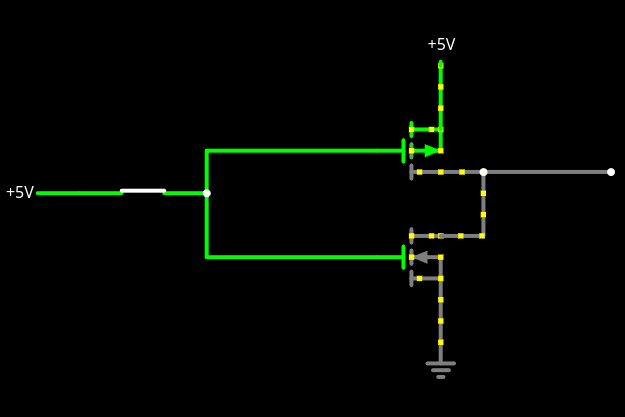
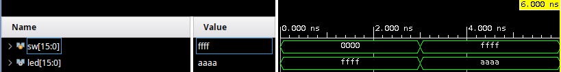
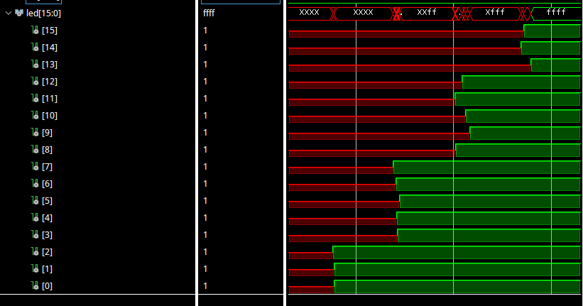
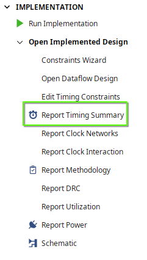
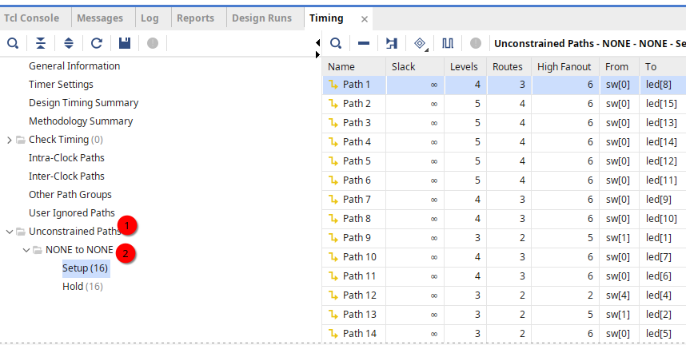

= Lab 07 - Delays and Glitches
:source-highlighter: highlight.js
:highlightjs-languages: verilog
:icons: font
:toc:
:last-update-label!:
:stem: latexmath

xref:class.zip[Download Class Materials]

== Introduction

Have you ever peered into the details of your PC's performance data and noticed
a frequency number like "1.8 GHz" (probably higher on modern PCs, but not by
much)? This is what is known as the clock rate of your CPU, and directly relates
to performance, and drives things like how many instructions per second your
computer can process.

Given that this number drives the performance of your computer, it behooves the
CPU manufacturers to make the fastest chips possible. It would be a big
competitive advantage for Intel if their CPUs could run even 20% faster than
AMD's or Apple's -- so why don't they just crank the clock speeds even higher?

In addition, you may have heard of a practice in enthusiast computing called
"overclocking", where the user of the PC will drive its clock speeds past that
which the manufacturer recommends. Why is there a recommendation, and why does
overclocking often lead to crashes or fires?

All of the above has to do with a fundamental hardware limit that all engineers
must run into at some time or another: physics. There are several ways in which
physics is here to ruin your day, and in this lab we will cover two of them,
with more information to come in later labs:

. Distance Delay (AKA Speed of Light)
. Gate Charge Delay (AKA Ohm's Law)

== Distance Delay

Let's imagine the following circuit:

.Simple Circuit

How long does it take for the output to go low when we flip the switch on the
left? The intuitive answer (and correct for human-based time), is
"instantaneous". However, and this is probably no surprise given the name of
this lab, that is not reality. Let's start with the simple bit, the speed of
light, which is, approximately, 300,000,000 meters per second.

While _blisteringly_ fast, that isn't infinitely fast. In addition, the waves
that carry "charge" or "information" through electronic circuits, namely
electrical and magnetic fields, do not travel through certain materials at fully
the speed of light. This is related to drift velocity and electron mobility in
the given medium the circuit is built of. That, however, is a topic for a much
more advanced material science class.

Where does this leave us, though? Thankfully, copper and silicon (generally) are
dang near 100% the speed of light. However, this still leaves us in a sticky
situation. Consider with me the following:

We have a signal, say, 1 GHz. That signal toggles between 0 and 5 volts _1
billion times_ every second. How far does the signal travel in that time? Well,
thankfully that's some extremely simple maths:

[stem]
++++
\frac{300,000,000 m/s}{1,000,000,000 Hz} = 0.3 m
++++

Woah -- 300 centimeters. That's about 10 feet. That means if we were toggling
our switch in the above circuit 1 billion times every second, the maximum length
our wire could be without having multiple state change on it is only 10 feet.
While that sounds like an extremely long piece of wire, imagine instead the
insides of a CPU. There are so many twists and turns as the signal has to
propagate, that it is not hard to imagine them having to travel easily that
distance even over the extremely small CPU die.

This delay we have been discussing is what is known as distance delay, and is
related to the physical proximity of the various components of circuitry to one
another. You would not want two deeply coupled circuits to be physically
disparate on your design.

== Gate Charge Delay

As if the above wasn't enough of a challenge, our circuit above has an
additional problem: the inverter. The inverter can be built out of two FETs in
an extremely simple circuit:

.Basic Inverter

In any even vaguely modern silicon manufacturing process, each of those
transistors will be no more than about 20 __nano__meters apart. That is 20 one
billionths of a meter. So that inverter can't be much more than this distance
in terms of distance delay. However, it has other problems. The terminal in
the middle of a FET is called the *Gate* and it is the switch to turn the
transistor on/off. It is shown blown up here:

.Expanded View of N-FET
image::img/expanded_fet.png[]

The wire labeled "G" is the Gate. Notice how it isn't connected to the rest of
the FET, there's a little gap. This is why the FE in FET (FET stands for Field
Effect Transistor), the Field Effect of the gate causes a channel to form
between the source and drain to allow conduction. However, unlike in a Bipolar
Junction Transistor (BJT) there is no current flowing through the gate. Thus, it
acts as a capacitor. There will need to be an amount of charge that has to build
up on the gate for enough of a field to form to influence the channel and allow
conduction.

In an ideal world, the gate would transition from 0 -> X volts instantaneously
(where X is the "on" voltage), however, once again, that is not the case. There
is a concept in electrical engineering that some of you may encounter later
called the "Lumped Element Model" that can help us model and understand this
situation.

.Lumped Element Gate
image::img/lumped_gate.png[]

NOTE: Values just for demonstration

The strength of the charge on our gate is visible on the stub at the top of the
capacitor. Don't worry too much about the EE portions of this, it is actually
a fairly simple circuit. The moment the switch closes, the voltage at the top of
the capacitor is 0 V, and that means we will get stem:[I = \frac{V}{R}] amps as
dictated by Ohm's law, and in this case that means stem:[\frac{5 V}{100 Ohm}
= 0.05 Amps]. This will begin to charge the capacitor, whose voltage will rise,
and thus the voltage across the resistor will go down, the current will go down,
and so on, creating a waveform like this:

.Capacitor Charge Waveform
image::img/charge_waveform.png[]

NOTE: Time on X axis, volts on Y

We can see that it takes a non-zero amount of time for the charge to build on
the gate of this transistor. If it, say, turns on at 3 V it will take about two
whole time divisions for things to start going. This means that even though the
circuit is tiny in terms of dimensions, it introduces a ton of delay
_electrically_ to the circuit due to its gate charging, as the effects of it
being turned on or off cannot begin to propagate until it actually _does_ turn
on or off.

== The Two Combined

Between regular distance delay and gate delay combine to form an overall
"Propagation Delay" within our digital circuits. This is the delay between the
input of a circuit changing and its output state stabilizing. It is this
principle that limits the frequency of digital circuits.

Think about the following. Imagine our NOT gate in the first diagram takes two
seconds to invert its input. Now, obviously, real silicon is literally billions
of times faster than this, but it helps to put things in second-time. If we
toggled our switch any faster than once every four seconds, we would risk the
output being incomplete or incorrect. This would be something known as a glitch,
and is what happens when we can't meet timing requirements in our designs.

In a more practical example, let's look at the following toy circuit:

.Toy Circuit
image::img/cascading_circuit.png[]

The inputs to each subsequent XOR depends on the input of the previous one. That
means, in the case of the third LED (the bottom most one), its circuit state
depends on both the output of the NOT and first XOR gate. That means the
propagation delay of our full circuit from the first switch to the output of the
third LED is the sum of all the gate and distance delays of _all elements in the
path_. These numbers can start adding up quickly if you have complex logic that
depends on other complex logic. If we assume that the NOT gates take
1 nanosecond to propagate, and the XOR gates take 4 nanoseconds, our full delay
would look something like this:

.Delay Excluding Distance
[stem]
++++
D_{full} \approx 1 ns + 4 ns + 4 ns \approx 7 ns
++++

NOTE: Distance delay is not included in this approximation.

Since our signal from the first switch to the third LED has to pass through the
NOT gate and both XOR gates, it will take approximately 7 nanoseconds to fully
stabilize. So, for 7 nanoseconds after flipping the switch, the output of the
circuit is _wrong_. That means things that might be downstream of this LED have
to be sure to wait or else act incorrectly and glitch the system.

== The Lab

=== Circuit under Study

In order to view this properly, we are going to implement a circuit very similar
to the one shown above, but for all sixteen switches and LEDs:

[[logic_table]]
.Circuit Logic Table
[cols="1,4"]
|===
| Signal  | Equation
| led[0]  | ~sw[0]
| led[1]  | led[0]  ^ sw[1]
| led[2]  | led[1]  ^ sw[2]
| led[3]  | led[2]  ^ sw[3]
| led[4]  | led[3]  ^ sw[4]
| led[5]  | led[4]  ^ sw[5]
| led[6]  | led[5]  ^ sw[6]
| led[7]  | led[6]  ^ sw[7]
| led[8]  | led[7]  ^ sw[8]
| led[9]  | led[8]  ^ sw[9]
| led[10] | led[9]  ^ sw[10]
| led[11] | led[10] ^ sw[11]
| led[12] | led[11] ^ sw[12]
| led[13] | led[12] ^ sw[13]
| led[14] | led[13] ^ sw[14]
| led[15] | led[14] ^ sw[15]
|===

This is effectively the same circuit as the toy example, but has sixteen
switches and LEDs instead of three. This will utilize the entire set of switches
and LEDs on the Basys 3 board, so be sure to edit the Constraints file as
required.

IMPORTANT: Implement this circuit onto your Basys 3 board in the file `top.v`.
Run the behavioral simulation as you have done in previous labs to be sure you
have everything wired up correctly.

=== Simulating the Circuit
.Simulation Output

NOTE: The LEDs should go from 0xFFFF to 0xAAAA if the circuit is correct.

In this simulation, which is the regular behavioral simulation, there is no
delay calculation done by Vivado in this simulation, so you can see at exactly
3 nanoseconds, our switches and LEDs both change state. We just spent the entire
lab up to this point saying that this isn't the real state of things, so what
gives?

=== Simulating the Circuit with Timing

In order to simulate the circuit with timing, Vivado needs to know every detail
about it. As we discussed above, each gate in use as well as the distance
between them gives us our total propagation delay. So, how does Vivado get this
information? From the implemented circuit.

Implementation involves fully realizing your circuit in FPGA resources as well
as placing and routing the design on the FPGA. This gives us both of the
variables in our equation for delay: what gates and how far apart. So, do that
now -- run the implementation on your design.

NOTE: Make sure you have done the constraints -- as which physical pins the
switches and LEDs are connected to contributes to these delays.

Once the implementation is done, run your simulation again, but this time with
post-implementation timing information:

.Run Post-Implementation Timing Simulation
image::img/post_impl_timing_sim.png[]

Once the test finishes, you see.... what?

image::img/test_failed.png[]

Test failed? But our circuit passed the behavioral simulation! Open up the
waveform view and zoom to fit to see more of what happened:

.Failing Timing Simulation
image::img/timing_sim_failed.png[]

That looks a lot different, and is because Vivado has annotated the real-life
delays from the implemented circuit into the simulation. As we can see, it takes
almost two nanoseconds for the LEDs to start changing after the switches change.
And throughout this changing time, the signal changes values many times (that's
what all the crossed lines mean). Let's zoom into that portion:

We can see a few things from this:

. The LEDs sooner in the chain (closer to `led[0]`) resolve fastest
. This is stabilizing on 0xFFFF not 0xAAAA! This is actually responding to the
  switches being at 0 at the *beginning of the simulation*.

It is clear that the simulation is not giving the circuit enough time to
stabilize, as defined by its total propagation delay. So... how do we know how
long to wait? Thankfully, there's timing information that Vivado will give to us
if we ask nicely:

.Report Timing Summary

A window will pop up with a ton of options. The default settings are going to
work perfectly for our purposes, and all other settings therein are all outside
the scope of this lab.

This will result in a table like as follows:

.Timing Report Table

Select first the Unconstrained Paths then the NONE to NONE groups. The Setup
timings section will have the numbers you are interested in.

I have omitted the actual values from the screenshot, but they will be in
columns named "Total Delay", "Logic Delay", and "Net Delay". Net delay is
approximately equal to the distance delay, and logic delay is approximately
equal to our gate delay as discussed above. The truth of the matter is a lot
more complicated. However, we can take a look at the Total Delay field to get an
absolute worst-case look at how long a change on a certain pin would take to
propagate to its output. The delays we see in the simulation waveform may not
match these, as the timing report only shows worst-case. The delays are
displayed in nanoseconds.

So, take a look at your timing table and edit the delays in the `test.v` file to
match your worst case timings. Rounding up to the nearest nanosecond will be
more than enough. Re-run and you should see your simulation pass!

If you're confused as to how to edit the delays, see the following code example:

.Delays in Simulation
[source,verilog]
----
include::src/delays.v[]
----

NOTE: Edit the number after the `#` to change the delay. This delay is shown in
major timescale.

== So what have we learned?

All of the stuff happening inside of our FPGA is significantly more complicated
than the simple behavioral simulation would have us believe. There are also
delays in how gates propagate their signal and how those signals travel from
gate to gate. This is actually going to be a feature we can leverage in future
labs, so keep all this in mind.

== Lab Deliverables

.IO Table
[cols="1,1,4"]
|===
| Signal  | Direction | Use
| sw[0]   | IN        | Switch input
| sw[1]   | IN        | Switch input
| sw[2]   | IN        | Switch input
| sw[3]   | IN        | Switch input
| sw[4]   | IN        | Switch input
| sw[5]   | IN        | Switch input
| sw[6]   | IN        | Switch input
| sw[7]   | IN        | Switch input
| sw[8]   | IN        | Switch input
| sw[9]   | IN        | Switch input
| sw[10]  | IN        | Switch input
| sw[11]  | IN        | Switch input
| sw[12]  | IN        | Switch input
| sw[13]  | IN        | Switch input
| sw[14]  | IN        | Switch input
| sw[15]  | IN        | Switch input
| led[0]  | OUT       | LED output
| led[1]  | OUT       | LED output
| led[2]  | OUT       | LED output
| led[3]  | OUT       | LED output
| led[4]  | OUT       | LED output
| led[5]  | OUT       | LED output
| led[6]  | OUT       | LED output
| led[7]  | OUT       | LED output
| led[8]  | OUT       | LED output
| led[9]  | OUT       | LED output
| led[10] | OUT       | LED output
| led[11] | OUT       | LED output
| led[12] | OUT       | LED output
| led[13] | OUT       | LED output
| led[14] | OUT       | LED output
| led[15] | OUT       | LED output
|===

. `top.v` with circuit implemented as per the <<logic_table, logic table>>
. `test.v` with delay values modified to match worst case timings
