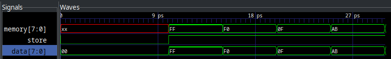
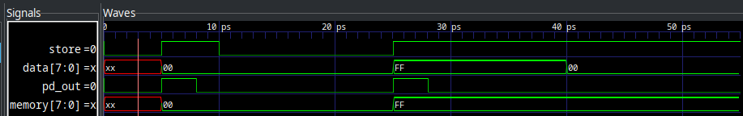
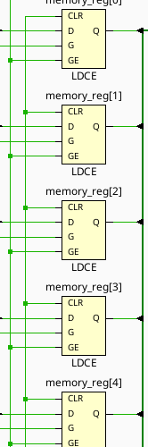
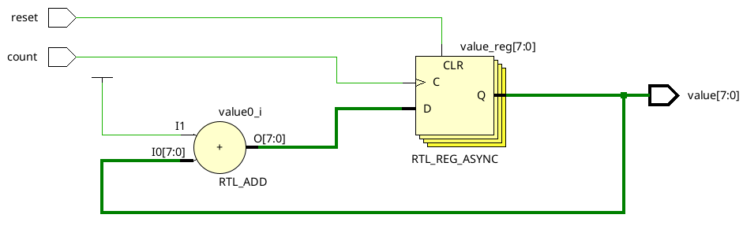

= Lab 10 - Edge Sensitive Circuits
:source-highlighter: highlight.js
:highlightjs-languages: verilog
:icons: font
:toc:
:last-update-label!:
:stem:

xref:class.zip[Download Class Materials]

== Introduction

During this lab we are going to extend on what we learned about synchronous logic and memory and learn about clocked circuits and state machines. We will narrow the focus on what it means to be synchronous to an event as well as learn how to use memory to drive complex behaviors in computer systems.

== Clocks, Edges, and Flip-Flops Oh My!

In last week's lab, we covered making circuits only change their output when certain signals were high. This meant those circuits were synchronous to whatever signal enabled them to change, usually a signal called `Store` or `Enable`. However, you can go even further, and we will in this lab. As an example, let's revisit the 8 bits of storage we wrote last lab, and take a look at some of its behavior:

[source,verilog]
----
include::src/byte_storage.v[tag=module_source]
----

It outputs:

[[dlatch_out]]
.D-Latch Output

Notice how as long as `store` is asserted, memory changes along with data? Depending on the requirements of your circuit, this could be super sub-optimal. It is more like a door that opens and lets whatever signal come in rather than a snapshot in time. This is of course useful in certain situations, but detrimental in others. In other words, we want to go from a *level sensitive* circuit to an *edge sensitive* circuit. See the image below for clarification:

.Edge vs. Level Sensitivity
[plantuml,format=svg]
....
include::src/level_vs_edge.puml[]
....

The `Level` state is a level sensitive circuit. The `Edge` state is a edge sensitive one. We can see here, that just like the D-Latch we learned last week, they both ignore the `D` input while `E` is low. The big difference shows _while_ `E` is high. Look at the time between 15 and 20, where `E` is high. We can see that the moment it goes high, both `Level` and `Edge` latch in the value. However, while `E` is high and `D` goes low again, the level sensitive circuit follows, while the edge sensitive circuit remains at the value that happened exactly when `E` went high.

This is what we mean by level sensitive and edge sensitive. Level sensitive memory stores the input value _as long as_ its enable signal is high. An edge sensitive one stores the input value _only_ when the enable transitions from low to high -- the edge. We can see this level sensitive behavior in our D-Latch from last week above: <<dlatch_out>>.

What circuit are we looking for? How do we get this edge sensitive behavior? In this case, we want to go from a D-Latch to a D-FlipFlop. Silly sounding name aside, this new circuit is exactly our match. Let's dive in. How do we go about making a circuit that only reacts to signal edges with only regular logic gates? We need a circuit that can act as an edge-detector, and feed that through to the input of the enable or store command of our D-Latch:

.Pulse Detector and D-Latch
image::img/dff_diagram.drawio.svg[]

And an example of what this output would look like (output of pulse detect elongated for demonstration):

.Pulse Detector and D-Latch Output

In this case, `pd_out` is the output of the pulse detector. It works by delaying and inverting the `store` signal so that we only output 1 from the AND gate for a brief period after the signal goes high. In reality, the width of these pulses with be _much_ lower, I have just shown them elongated for visual effect.

NOTE: See the Verilog source code for this module and its simulation in <<pd_sim_src>>.

If you've gone and looked at the source code for how to write this, you'll see it's cumbersome and not behavioral at all. So how do we convey this in a more behavioral way? Well... why don't we just remove `data` from the sensitivity list? If the logic in the always block is only supposed to evaluate when the signals in the sensitivity list change, that'll surely fix it. Let's take a look at the simulation output from this change:

[source,verilog]
----
include::src/byte_storage.v[tag=changed_sensitivity_list]
----

image::img/dlatch_nomem_output.png[]

Holy cow! That fixed it. There's a huge _but_ attached to this, however. Let's run implementation on this and see what Vivado generates as the circuit:

.Uh oh, those aren't flipflops

Huh. Those are regular D-Latches, not D-Flipflops. You will see this in part 1 of the lab -- the simulation and actual implementation will differ quite strongly in their behavior. Don't blindly trust the simulations!

Thankfully, there is actually a method for doing this in behavioral Verilog. We are trying to get a block to be sensitive to the rising edge of our store signal, and for this you can use the keyword `posedge` in the sensitivity list:

[source,verilog]
----
include::src/byte_storage.v[tag=with_ff]
----

And now, if we implement this in Vivado, let's see what the synthesis tools give us...

.Ah, now *that* is a FlipFlip!
image::img/right_implementation.png[]

Notice now how the blocks have a `C` pin marked with a `>` -- that means these are clocked _edge triggered_ flip flops rather than level triggered latches as we saw in the previous implementation screenshot. These should now actually behave as flip flops. Also notice the `R` pin -- that's a reset. Allows the circuit to be reset to a `0` state by asserting that value. We will be including this on all circuits from here on out as well.

The output behavior of the D Flip Flop can be described in several ways, and I'll show them all below (showing just Q).

include::src/d_ff_truth_table.adoc[]

This table describes the behavior as states, where Q~current~ is the current output of Q, and Q~next~ is the state of the output _after_ the next clock edge.

We can also describe this behavior in a more simple way, with something called a characteristic table:

include::src/d_ff_char_table.adoc[]

Since the output of our D Flip Flop doesn't depend on the current state, we can leave those columns as X. Since no matter what, if the input is 1, the next state of Q after a clock edge will be 1, and 0 for 0.

The final way to annotate the behavior of sequential circuits is via the excitation table, as shown below:

include::src/d_ff_ex_table.adoc[]

This one may look confusing for a second (and redundant) but occasionally will represent the circuit in a more simple way. Instead of describing the next state in terms of current and input, we describe the input required to achieve a next state based on current. It's a transposition of the traditional truth table.

=== OK, So What is the Point?

What can we do with these new edge triggered circuits? Well, really, implement the rest of all of computer science for a start. All real computer memory systems are based off of what are called *clocked circuits*. Let's start with discussing clocks, as from here on out in our labs we will primarily be utilizing them.

A clock is any digital signal that toggles at a (usually) fixed frequency. That is, every N seconds, it switches from HIGH to LOW or vice versa. You can think of this like the tick of a metronome for a musician, or the synchronizing hands of the Orchestra's Conductor. It is a reliable signal that gives the entire circuit synchronous edges that can drive all amounts of complex behavior.

Let's start with a simple example of something you cannot do with level triggered logic -- counting. Let's say we want to design a circuit that adds 1 to a value each time the clock triggers. Trying with level sensitive circuitry might look like this:

.Level sensitive counter
[source,verilog]
----
include::src/counter.v[tag=level_counter]
----

If we try to simulate this, or implement this, we will run into a problem, though. Vivado (and any other synthesis tool) will implement this using D-Latches and an 8 bit adder:

.Level Sensitive Counter Elaboration
image:img/level_sensitive_counter.png[]

If we try to construct a sequence diagram for this, we would get:

. Value is 0
. Adder adds 0 + 1
. Value changes to 1
. Input to adder changes to 1
. Adder adds 1 + 1
. Value changes to 2
. Input to adder changes to 2
. ...

This never resolves. This will just _rapidly_ count as fast as the gates can toggle. _Probably_ not what we intended. This serves as an excellent example for where edge sensitive circuits are extremely effective. If the memory cannot latch in a new value until the next clock cycle, then there is no endless loop of adding.

.Edge Sensitive Counter Elaboration

Here we can see that Vivado elaborated to 8 D-FlipFlops. In this case, we will only latch a new value into the flip flops on the positive edge of the count signal, giving us this output:

.Edge Counter Output
image:img/edge_count_out.png[]

NOTE: Full implementation of these counters is available in <<edge_level_counters>>

=== Setting Initial State

In all of these cases, initial state is a problem. When the FPGA is programmed, it has no way of knowing the state of any of the various pieces of memory within. To fix this, we can put a simple `initial begin` block in our logic to set default cases. See an example below:

[source,verilog]
----
module example(
    input A, B, C,
    output reg Q
);

    initial begin
        Q <= 0;
    end

    // ... Other logic here
endmodule
----

== Lab Procedure

In today's lab, you will be creating three different edge sensitive circuits and clocking them to `bntC` on the board. The three you will be creating are:

. D Flip Flop
. JK Flip Flop
. T Flip Flop

=== D Flip Flop

Using the `posedge` syntax shown above, build a D Flip Flop module. Make sure to include the initial state! Wire it up as shown below:

.IO Table for D Flip Flop
|===
| Signal    | Purpose        | Direction
| sw[0]     | D Flip Flop D     | IN
| btnC      | D Flip Flop Clock     | IN
| led[0]    | D Flip Flop Q     | OUT
| led[1]    | D Flip Flop ~Q    | OUT
|===

=== JK Flip Flop

Using the D Flip Flop module you just built, implement a JK Flip Flop. A JK Flip Flop is built using a single D Flip Flop and some combinatorial logic to modify its inputs. Instead of exposing a single Data input, it exposes two: J and K. The combinatorial logic combines J, K, Q, and ~Q (the Q and ~Q inputs are from the internal D Flip Flop) to drive the Data line of the internal D Flip Flop. See the diagram below:

image:img/jk_ff.drawio.svg[]

The excitation table is shown below:

.JK Flip Flop Excitation Table
|===
| Q~current~ | Q~next~ | J | K
| 0          | 0       | 0 | X
| 1          | 0       | X | 1
| 0          | 1       | 1 | X
| 1          | 1       | X | 0
|===

The behavioral description of the JK Flip Flop is as follows:

* To hold state at Q = 0, J must be 0
* To hold state at Q = 1, K must be 0
* To reset from Q = 1 to Q = 0, K must be 1
* To set from Q = 0 to Q = 1, J must be 1
* To invert Q, set both J and K

The truth table for your logic is below:

.JK Flip Flop Combinatorial Logic Truth Table
|===
| J | K | Q | D
| 0 | 0 | 0 | 0
| 0 | 0 | 1 | 1
| 0 | 1 | 0 | 0
| 0 | 1 | 1 | 0
| 1 | 0 | 0 | 1
| 1 | 0 | 1 | 1
| 1 | 1 | 0 | 1
| 1 | 1 | 1 | 0
|===

Using your D Flip Flop module and some combinatorial logic, implement this JK Flip Flop. Wire it up as shown below:

.IO Table for JK Flip Flop
|===
| Signal    | Purpose        | Direction
| sw[1]     | JK Flip Flop J     | IN
| sw[2]     | JK Flip Flop K     | IN
| btnC      | JK Flip Flop Clock     | IN
| led[2]    | JK Flip Flop Q     | OUT
| led[3]    | JK Flip Flop ~Q    | OUT
|===

=== T Flip Flop

The T Flip Flop is named because it is a Flip Flop that toggles state on each clock edge with its input T asserted. It can be implemented several ways, including some very clever ones (hint: read the behavioral description of the JK Flip Flop).

.T Flip Flop Characteristic Table
|===
| T | Q~next~
| 0 | Q
| 1 | ~Q
|===

.T Flip Flop Excitation Table
|===
| Q~current~ | Q~next | T
| 0          | 0      | 0
| 0          | 1      | 1
| 1          | 0      | 1
| 1          | 1      | 0
|===

The behavioral description of the T Flip Flop is as follows:

* The output will invert on each clock cycle if T is asserted
* The output will stay the same on each clock cycle if T is deasserted

Build the T Flip Flop and wire it up as follows:

.IO Table for T Flip Flop
|===
| Signal    | Purpose        | Direction
| sw[3]     | T Flip Flop T     | IN
| btnC      | T Flip Flop Clock     | IN
| led[4]    | T Flip Flop Q     | OUT
| led[5]    | T Flip Flop ~Q    | OUT
|===

=== Summary
.IO Table Summary
|===
| Signal    | Purpose        | Direction
| sw[0]     | D Flip Flop D     | IN
| sw[1]     | JK Flip Flop J     | IN
| sw[2]     | JK Flip Flop K     | IN
| sw[3]     | T Flip Flop T     | IN
| btnC      | D Flip Flop Clock     | IN
| btnC      | JK Flip Flop Clock     | IN
| btnC      | T Flip Flop Clock     | IN
| led[0]    | D Flip Flop Q     | OUT
| led[1]    | D Flip Flop ~Q    | OUT
| led[2]    | JK Flip Flop Q     | OUT
| led[3]    | JK Flip Flop ~Q    | OUT
| led[4]    | T Flip Flop Q     | OUT
| led[5]    | T Flip Flop ~Q    | OUT
|===

[[pd_sim_src]]
== Appendix 1: Pulse Detect into D-Latch Verilog Code

[source,verilog]
----
include::src/pd_dlatch_sim.v[]
----

[[edge_level_counters]]
== Appendix 2: Edge and Level Sensitive Counters
[source,verilog]
----
include::src/counter.v[tags=*]
----
