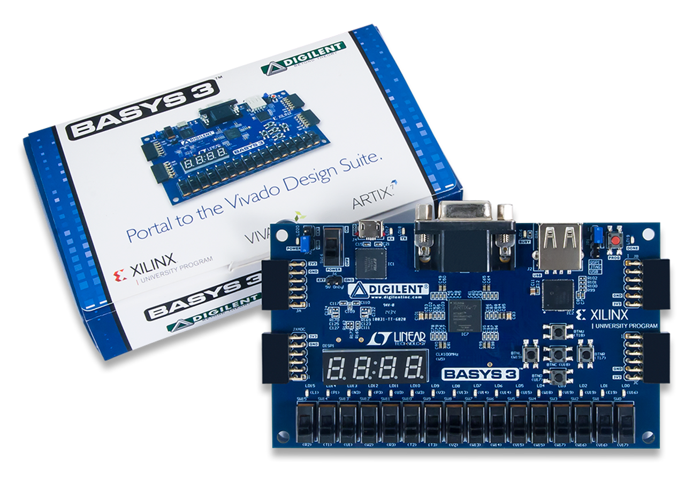
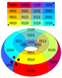
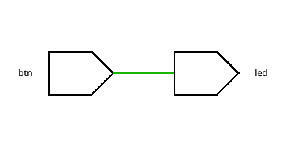
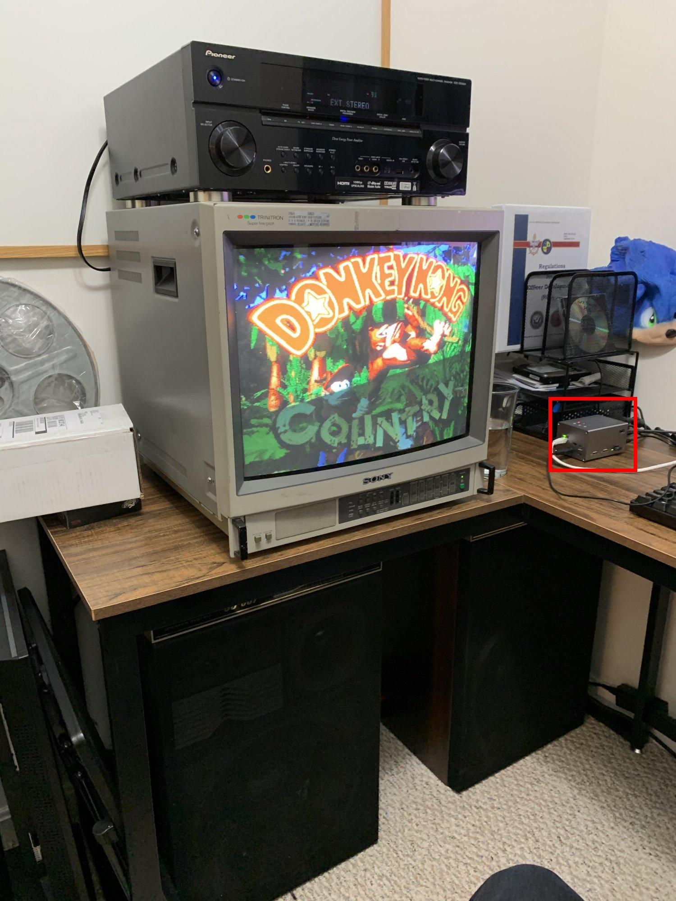
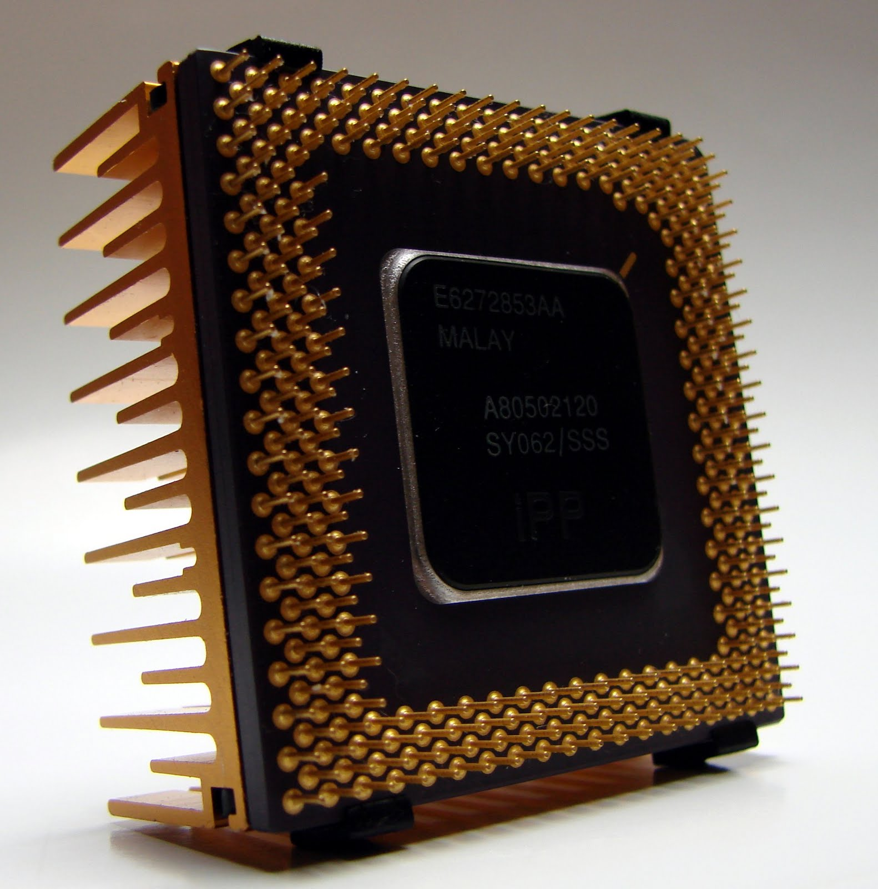
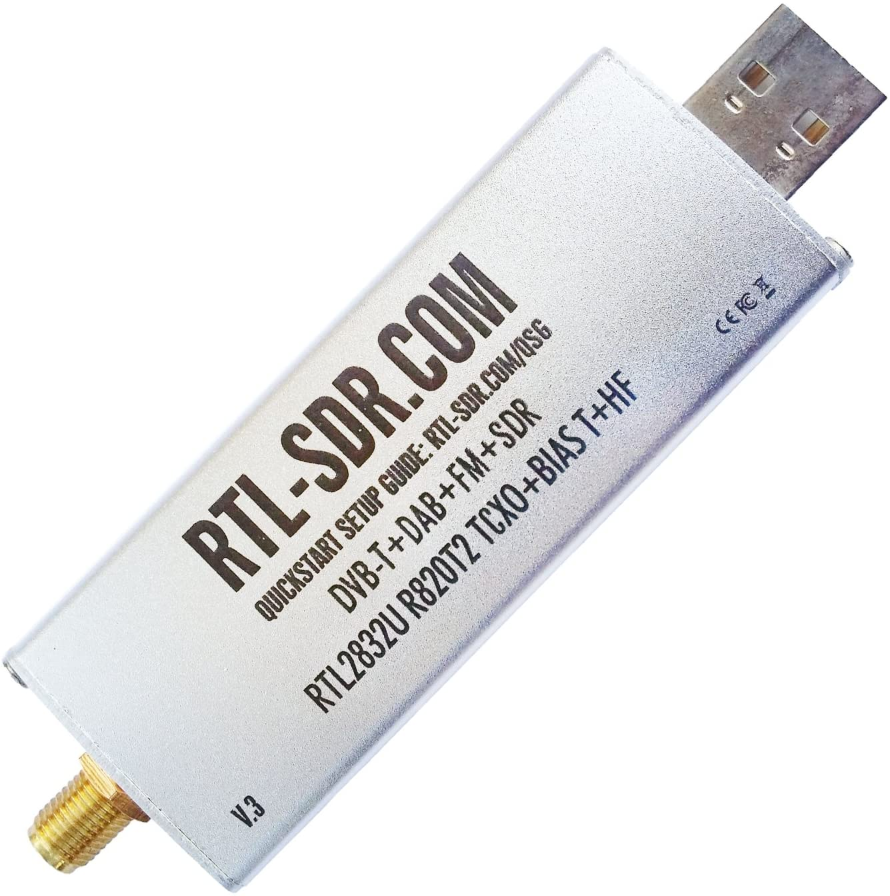
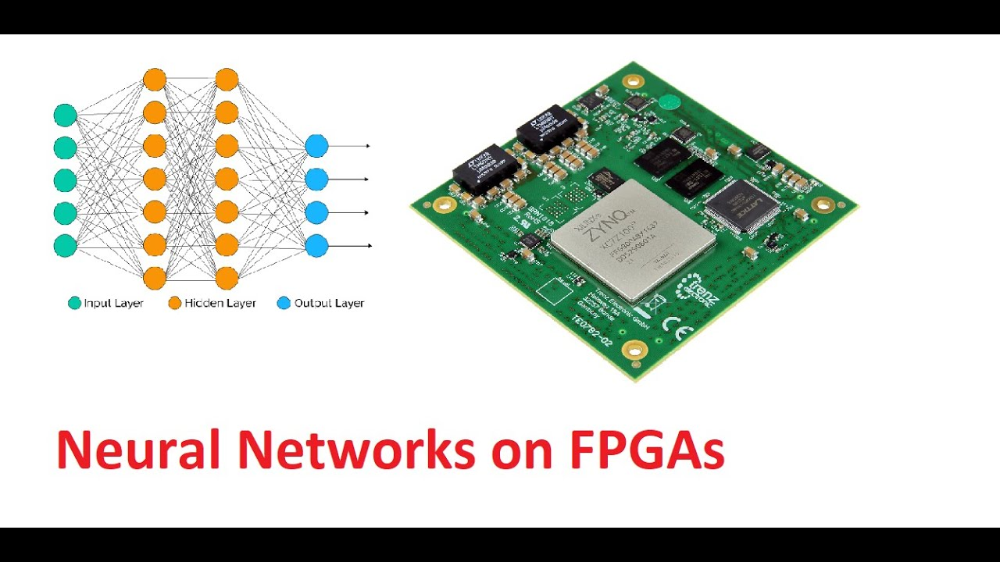

= Welcome to ECE230L
:source-highlighter: highlight.js
:highlightjs-languages: verilog
:revealjs_theme: simple
:last-update-label!:
:revealjs_width: 1600
:revealjs_height: 900
:revealjs_margin: 0.05
:customcss: img/extra.css
:icons: font

[.columns]
== Structure of Lab

[.column]
[.compact-list]
* Each week, there will be a problem available on the site
* PLEASE read before you come in, it will help
* Demonstrate the working design to your TA/Instructor
* Write lab report, submit with code to Canvas
** Code can be attached as .zip or link to GitHub

[.column]
. 20% for Lab Report
. 50% for code
. 30% for demonstration
. Absolutely no plagarism or AI

[.columns]
== What we will be doing

[.column]
. Digital Design
. Verilog Hardware Description Language
. Hands on with RTL Engineering

[.column]

[.columns]
== Digital Design

[.column]

[.column]
. Basics: AND/OR/NOR...
. Intermediate: Logic equations and minimization
. Advanced: Behavioral and sequential circuits

[.columns]
== Verilog HDL

[.column]
* Verilog is *not* a programming language
* You are describing a physical circuit
* There is no "execution" or "order"

[.column]
[.mid-code]
[source,verilog]
----
module top(
    input btn,
    output led
);

    assign led = btn;

endmodule
----

=== Resulting Circuit

There is no "clock", no execution, no assignment -- the FPGA will physically conect that button to that LED.

== Hands on With RTL

image::img/fpga_arch.jpg[height=300]

What can you use FPGAs for?

=== MiSTER (perfect emulation)

=== CPU Design

=== SDR

=== Neural Compute

