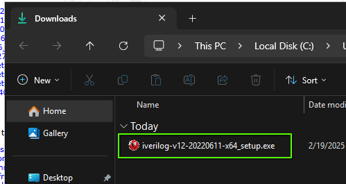
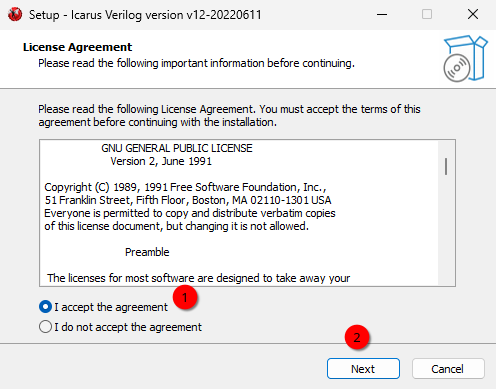
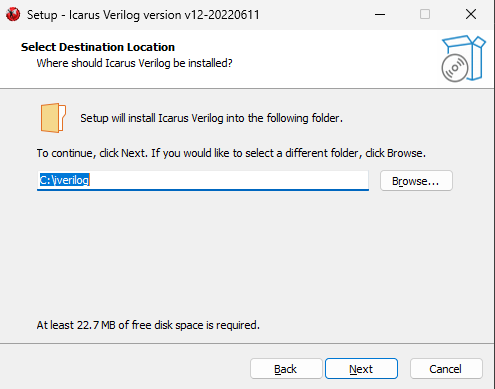
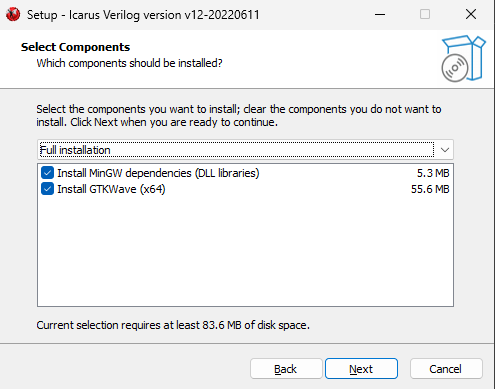
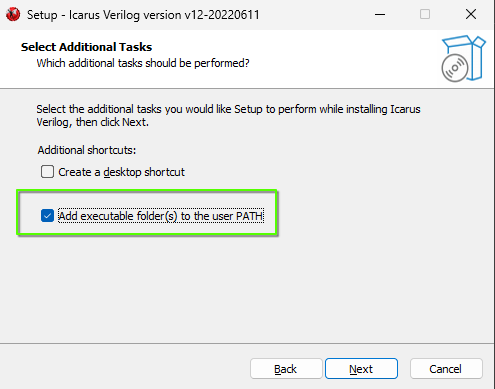
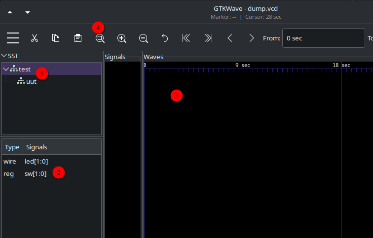

= Icarus Verilog
:source-highlighter: highlight.js
:highlightjs-languages: verilog,bash
:icons: font
:toc:
:last-update-label!:

== Introduction

Icarus Verilog is an absolute masterpiece of software. It is a fully open
source, standalone Verilog simulation engine written in C++ and available for
all major platforms, including MacOS, Windows, and Linux.

This material will guide you through installation and usage of Icarus Verilog to
do most of the designs you will find in lab this semester.

== Installation

=== Windows

Homepage https://bleyer.org/icarus/[Here].

You will want the following download:
https://bleyer.org/icarus/iverilog-v12-20220611-x64_setup.exe[Windows Setup].

. Double click the executable +

. Accept the license agreement +
 
. Press next through the note
. Keep the default installation path +

. Make sure to select Full Installation +

. Press next to create start menu folder
. Check Add executable folder(s) to the user PATH +

. Then press Install and Finish

=== Linux

See your distro maintenance manual for more information, but will almost
certainly just be:

[source,bash]
----
sudo apt install iverilog gtkwave
----

=== MacOS

First, if you have not, install Homebrew: https://brew.sh/

Then, follow these instructions:
https://formulae.brew.sh/formula/icarus-verilog#default

GTK Wave is no longer officially supported:
https://formulae.brew.sh/cask/gtkwave#default

== Usage

Icarus Verilog is extremely simple to use. Within the directory that contains
all of your Verilog files that you are working on, simply run the following
commands (open a terminal in the directory with all your .v files):

[source,bash]
----
iverilog *.v # This "compiles" the Verilog into the executable `a.out`
vvp a.out # This runs the simulation
----

All of the projects in the lab are structured such that these two commands
should properly simulate everything you want to see, aside from syntax errors
(which you would also get in Vivado).

The test benches are also normally set up to dump waveforms into `dump.vcd`
which should be present in the same directory as `a.out`. View these by opening
them in GTKWave:

[source,bash]
----
gtkwave dump.vcd
----

This will pop up a waveform view that is nearly the same as Vivado:

. The "scope" view that contains the modules you might be interested in. This is
heirarchical like Vivado.
. The signals view. Double click on these to have them show in the Wave view.
. The Waveform view. Double click a signal to expand the individual bits.
. Zoom to fit button. Your friend.

The simulation, if it has any pass/fail critera, will show in the terminal after
you run the vvp command (example from Week 6):

----
half_sub Test Passed: A=0, B=1 => Y=1, B_out=1
ones_compliment Test Passed: A=0111, B=0101 => Y=1100
ones_compliment Test Passed: A=1010, B=0111 => Y=0010
twos_compliment Test Passed: A=01010111 => Y=10101001
twos_compliment Test Passed: A=00000001 => Y=11111111
twos_compliment Test Passed: A=00000010 => Y=11111110
twos_compliment Test Passed: A=00001000 => Y=11111000
test.v:99: $finish called at 170000 (1ps)
----

You can use these simulation outputs to work on and finish your labs even if you
cannot or do not wish to install Vivado on your PCs.