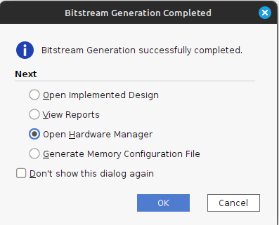
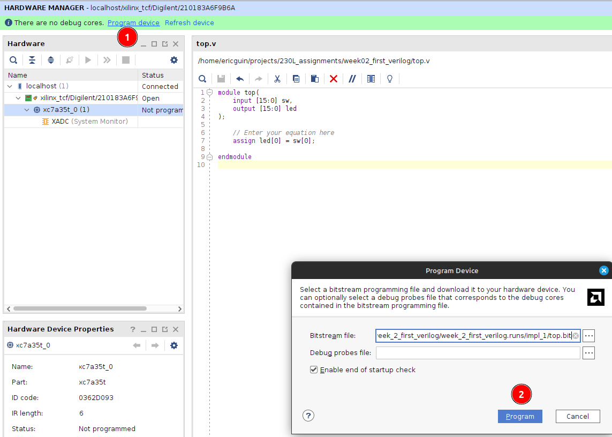

= Lab 02 - Introduction to Verilog
:source-highlighter: highlight.js
:last-update-label!:
:highlightjs-languages: verilog
:icons: font
:toc:

xref:class.zip[Download Class Materials]

== Introduction

Verilog will be very different to you from the other programming
languages you have used in the past. It does not sequentially execute,
but rather describes the shape of a circuit. We will dive more into this
as the class progresses, but suffice it to say that there will be a
learning curve.

Let’s start out with a few overarching concepts you will see throughout
this lab. There are several basic structures to Verilog:

* Modules
* Signals
* Expressions

Modules contain signals, and signals are driven by expressions. Signals
can be of two forms:

* `wire`
* `reg` (short for Register)

We will dive into the difference between these in later labs. These
signals are driven by expressions, which will look a lot like
mathematical equations in the beginning. For now, we will use this
subset of operators:

* `&` - bitwise AND
* `|` - bitwise OR
* `^` - bitwise XOR (exclusive-or)

The truth tables for those are below (Y is output, A+B are inputs):

AND:

[cols=",,",options="header",]
|===
|A |B |Y
|0 |0 |0
|0 |1 |0
|1 |0 |0
|1 |1 |1
|===

OR:

[cols=",,",options="header",]
|===
|A |B |Y
|0 |0 |0
|0 |1 |1
|1 |0 |1
|1 |1 |1
|===

XOR:

[cols=",,",options="header",]
|===
|A |B |Y
|0 |0 |0
|0 |1 |1
|1 |0 |1
|1 |1 |0
|===

One final operator we will see frequently is the *inverter* operator
`~`, which simply bitwise inverts a signal. `0` becomes `1` and
vice-versa. When you invert each of those operators above they become
NAND, NOR, and XNOR.

== Assignment

Your mission, should you choose to accept it, is to light up a single
LED on the Basys3 board. We will do this by opening up `top.v`. There is
a comment within this file noting where to put your equation, but let’s
quickly go through what is here in the file:

[source,verilog]
----
module top(
    input [15:0] sw,
    output [15:0] led
);

    //Enter your equation here

endmodule
----

The file starts with a `module` declaration. Think of modules as lego blocks,
throughout this class we will develop modules with certain behaviors, and
connect them together through their inputs and outputs.  Our module here has 16
inputs named `sw` and 16 outputs named `led`.  These correspond to the 16 user
switches and 16 user LEDs on the Basys3 board. These signals are declared as
vectors, whose syntax is as follows: `type [MSB:LSB] name`. Type being either
`reg` or `wire` (or `input`/`output` in a module, but that just becomes the type
fed in), name being the name of the signal, and them MSB and LSB are the most
significant bit number and least significant bit number.

In the case of our signals, they are 16 bits wide, with 15 being the
most significant bit, and 0 being the least. These correspond to
SW0-SW15 (seen as `sw[0]` and `sw[15]` respectively), and LED0-LED15 on
the board.

The logic we are starting with is all asynchronous `wire` based logic.
You can think of this as describing a circuit you hook up on a
breadboard. You declare these expressions with the `assign` keyword. We
want to design the following circuit:

.Circuit Diagram
image::img/DesiredCircuit.svg[Circuit Diagram]

Basically, we want to hook up the signal that is `sw[0]` directly to the
signal that is `led[0]`. To do this, we use the assign statement, then
the signals much as you might expect from another programming language:

[source,verilog]
----
assign led[0] = sw[0];
----

NOTE: This is an extremely vital part of the process. Always simulate your code!
It results in a much shorter feedback loop, as the build process is so lengthy.

== Building your Vivado Project

At this stage of the project, we now have Verilog code describing our
desired circuit. We will now move on to taking this code and actually
implementing it on the Basys3 Dev Board. To do this, we will need the
Vivado software. The lab PCs you use will have this software already
installed on them. If you have followed the instructions in the previous
week and installed it on your own laptop, you may also use that.

Launch Vivado and hit 'Create Project'. You should have already set up
the Digilent board files on your PC, and they will almost certainly
already be set up on the lab PCs, so the next steps should be fairly
simple.

.Create Project
image::img/create_project.png[Create Project]

Hit 'Next' on the window that appears. Now, enter your project details
– something meaningful for the project name (e.g. week_2_first_verilog
or similar) and select a good location. *Note:* the lab PCs
automatically wipe themselves fairly frequently, so _DO NOT EXPECT TO
SAVE WORK ON THEM_. Make sure to leave *Create project subdirectory*
selected or you may get some unexpected results.

.Project Information
image::img/project_info.png[Project Information]

Then, hit Next. You will be presented with a project type dialog. Make
sure to select 'RTL Project' and uncheck 'Do not specify sources at
this time':

.Project Type

Hit Next. Now, you will add in the Verilog files that you wrote in the
sections above. Hit the *Add Files* button, and navigate to your
`top.v` and `test.v` files. Then hit OK.

.Add Files
image::img/add_files.png[Add Files]

Before you hit next, uncheck *Copy sources into project*. In addition,
set `test.v` to *Simulation only* and make sure `top.v` is set to
*Synthesis & Simulation*.

.File customization

Now, hit next. It will now show a second file selection dialog for
adding Constraints files. They will be explained below, but you need to
add the one called `constraints.xdc` in the root of this repository. Do
that with *Add files* like in the previous step. Again, make sure
*not* to copy into project.

.Add Constraints

Hit Next. The dialog it shows you now is an important one to get right.
In order to properly synthesize and implement the circuits you specify
in Verilog code, Vivado has to know what hardware you are targeting. We
are using a pre-built dev board, so hit the *Boards* tab and type in
*Basys*. You should be able to specify the Basys3 board, which tells
Vivado to use the xc7a35tcpgq236-1 part that Digilent designed onto the
board. We will get more into the details of what that part number
specifies later. If the board is not present, hit the *Refresh* button
in the bottom left of the window. Then, search up Basys3. In the status
column there will be a download icon. Click that to get the board files.

.Board Selection

Select the board and hit Next. Verify that your project summary shows
something similar, then hit Finish:

.Project Summary
image::img/project_summary.png[Project Summary]

=== Vivado Walkthrough

.Vivado Walkthrough
image::img/vivado_walkthrough.png[Vivado Walkthrough]

. *Sources Pane* - This will be visible on most interface modes, and shows
the source files in the project. There are a few very important things
to note about this. There are *bolded* files shown in this. Bolded files
are known as the Top Level source file for that given section. Note,
there is one in *Design Sources* as well as *Simulation Sources*.
You can think of these as *main* or *entry point* files as you would
see in other programming languages. *If you are having issues
programming or simulating* make sure that you have the correct files
selected as top level. You can change this by right clicking on one and
selecting *Set as top*. Additionally, make sure no simulation files
show under Design Sources.
. *Editor/view window* - This changes a lot based on what mode you have
selected. Under Project Manager, this will show a summary of the
project. In most other modes it will show text editors, utilization
maps, or more. This pane is very dynamic.
. *Project Manager Mode* - Click on this text to go to the project manager
mode. Additionally, hit any of the smaller buttons underneath it to do
various actions, like access project settings, add sources, and manage
IP.
. *IP Integrator Mode* - We will potentially use this later in the class.
. *Simulation Mode* - Hit this large button to return to open simulations.
You click on the Run Simulation button underneath it to launch the
simulation. We will be doing this shortly.
. *RTL Analysis Mode* - Similar to other programming languages, there are
style guides, linting, and static analysis tools available for Verilog.
This is an extremely deep topic, and we will begin to work with this
later in the class.
. *Synthesis Mode* - Hit this button to open the view of synthesis
results. Synthesis is a step in the *compilation* process of Verilog,
and we will dive into it more in later labs.
. *Implementation Mode* - Hit this button to open and view the implemented
design. Implementation is a later step in teh *compilation* process of
Verilog, and again we will dive into it more in later labs.
. *Program and Debug Mode* - This button gives you access to the… well,
program an debug features in Vivado. We will use these shortly to put
our fresh verilog code onto our boards.
. *Tcl Console* - Tcl (pronounced tickle
https://groups.google.com/g/comp.lang.tcl/c/4KfTRIr5ZxE/m/XIw-gnbxIyMJ[no&#44;
I’m not kidding]) is the backend scripting language of Vivado and its
tooling. All warnings and errors will show here.
. *Messages* - This tab gives you access to logs and outputs of the
various steps of your process. Check between this and the Tcl Console
tab for more information on errors.
. *Status area* - This will show if anything is currently running in the
background. If you think nothing is happening after you start a run,
check here first.

=== Simulating our circuit

NOTE: ALWAYS simulate your circuits first. It is a big time saving measure, and
the results can help you easily narrow down problems in your designs that would
be otherwise impossible to find.

One of the most important tools on your belt while designing RTL
circuits is the simulation/update loop. You will make a design, simulate
it to make sure it does what you expect, and update any failures. It’s
_sorta_ like debugging an application you’re writing. We will want to
make sure our circuit simulates properly before we program the device,
so let’s do that now.

Hit the *Run simulation* button under the *Simulation* tab, and
select *Run behavioral simulation*:

.Run Simulation
image::img/run_simulation.png[Run Simulation]

This will kick off the simulation process, and halt on the `$finish;`
directive in our test file. Nothing will happen to the board (if you
have it attached). This is purely a software-based simulation of your
circuit. Towards the top tabs, you should see an *Untitled X* (X will
change depending on the number of simulations you’ve launched). Hit that
to see the simulation waveform:

.Simulation Waveform

Hit the zoom to fit button (1), and expand the `sw` and `led` signals to
see the results of the simulation (2):

.Simulation output

As you can see, at a time of 200 ns, our switch turns on and so does our
LED! Perfect, exactly what we wanted.

=== Ok, get on with it

I’m going to give a very short overview of the steps that happen as you
*compile* RTL code, whatever flavor it may be. It is a process quite
unlike that of traditional compilation you might be used to in
C/C++/Java/etc. There are a few main steps, split into two main
sections:

==== Part 1 - Implementation

Circuit generation is most analogous to the compilation steps in non RTL
languages. It is responsible for taking the letters you type into a text
file, and translating them into things the underlying hardware will
understand – in this case, logic gates.

The Synthesis step is the first stage of this. It takes your Verilog
code and generates something called a *netlist*, which is just a
connection representation of an electrical circuit. It will quite
literally describe *the output of the and gate goes into the inverter
goes into…*. You can think of it as a machine-readable electric
schematic.

Next, comes the Implementation step. This takes the synthesized netlist
from the previous step, and maps it onto the hardware specifics of your
chip. This is where selecting the right part in the project creation is
very important. The implementation step requires intimate knowledge of
the resources available on your particular FPGA to operate.

==== Part 2 - Bitstream Generation

This synthesized and implemented output is still mostly useless. We know
what and how many of the various bits and bobs in the FPGA to use.
However, the FPGA needs to know _where_ to put them. This is where Place
and Route comes in. In my opinion, RTL Place and Route algorithms are
some of the most incredibly impressive inventions humankind has ever
produced.

They are responsible for the herculean task of actually physically
locating your circuit into the FPGA. This might sound easy on the
surface, but for reasons we will dive into in future labs – it is
anything but. Just take my word for it for now.

Finally, once we know what, where, and how many of everything to use, we
can generate the bitstream for our FPGA. This is basically a file that
tells it which switches to close to connect our various bits together
and actually makes the circuit come to life on our FPGA. At this point,
we are now ready to watch an LED turn on when we flip a switch.

=== Blast those Bits

To make all of this incredible process happen, all you need to do is hit
the *Generate Bitstream* button. Yep, that’s it. This will start the
entire incredible chain of operations described above rather seamlessly.
It should not take super long, but be sure to watch the status area to
make sure things are still happening. When you hit that button, it will
first ask you if you want to run the implementation phase described
above. Hit yes:

.Run implementation

Then, accept the defaults presented in the dialog, and hit OK. *Note:*
the *Number of jobs* dropdown will be different depending on the
core/thread count of the machine you are running Vivado on. Don’t worry
about this much.

.Launch runs
image::img/launch_runs.png[Launch runs]

Off it goes. Notice now how the status area is populated with dialogs:

.Status area
image::img/status_area.png[Status area]

This means everything is going well. Shortly (depending on the age/power
of your computer) everything should complete. When it does, it presents
the generation complete dialog, select *Open Hardware Manager* and hit
OK:

.Generation Complete

Plug in your Basys3 via the Micro-USB cable, make sure the power is on,
and hit *Open Target* and select *Auto Connect*:

.Open Target
image::img/open_target.png[Open Target]

This should show up with your board on the left hand side. If so, press
the Program device button, and hit Program on the resulting dialog:

.Program device

You should now observe that flipping the switch all the way on the right
illuminates the LED above it. If so, notify your TA/Lab Professor to get
checked off, and you’re done!
