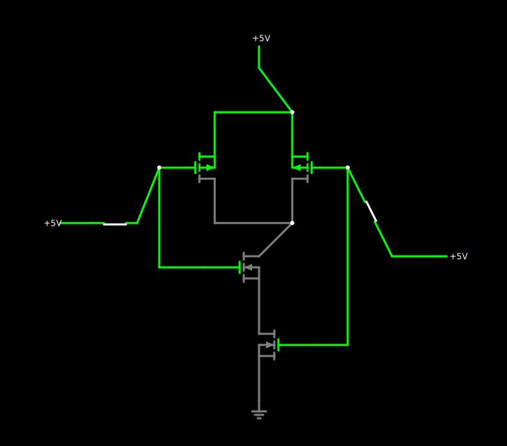

= NAND Only Design
:last-update-label!:
:source-highlighter: highlight.js
:highlightjs-languages: verilog
:revealjs_theme: simple
:revealjs_width: 1600
:revealjs_height: 900
:revealjs_margin: 0.05
:customcss: img/extra.css
:icons: font

== DeMorgan's Law

=== Introduction
DeMorgan's Laws are transformation rules that are used to simplify Boolean expressions. They are essential in digital logic design.

=== DeMorgan's Theorems
* Theorem 1: !(A + B) = !A * !B
* Theorem 2: !(A * B) = !A + !B

== Converting Circuits to NAND Only Design

=== Why NAND Gates?
NAND gates are universal gates, meaning any Boolean function can be implemented using only NAND gates. This can simplify the manufacturing process and reduce costs.

=== How do NAND gates simplify circuits?

* https://tinyurl.com/26bd8e26[Circuit JS Demonstration]

=== Example Conversion
Consider the following circuit: `Y = (A & B) | C`

. Identify all the gates in the circuit.
. Convert AND gates into NAND gates
. Double invert OR gate inputs
. Apply DeMorgan's Theorems to convert OR gate into NAND gates

* https://tinyurl.com/25sdv9mg[Example Conversion]