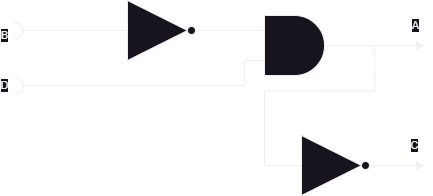
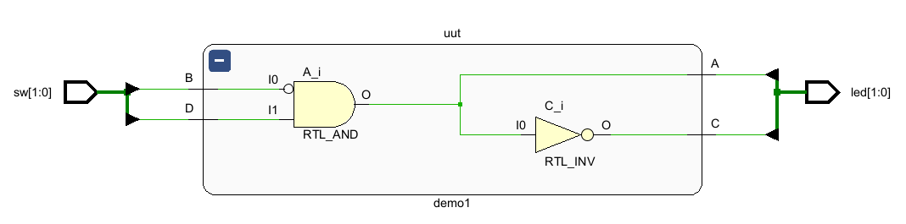
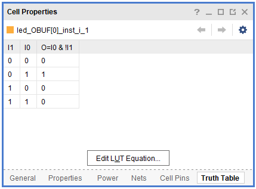

= How To Verilog
:last-update-label!:
:source-highlighter: highlight.js
:highlightjs-languages: verilog
:icons: font
:toc:

This is your first real complicated project in Verilog, so let’s really
dive in. We are going to cover *Continuous Assignment* and *Structural
Verilog* as opposed to *Procedural Assignment* and *Behavioral Verilog*.
Those concepts will come later in this lab.

As such, let’s start with the two major concepts of *Continuous
Assignment* and *Structural Verilog*, as they are foundational concepts
upon which this lab is based. Thankfully, it’s in the name! If only it
were that easy…

== Basic Verilog Operators

Here’s the basic verilog operations:

include::src/verilog_operations.adoc[]

For these first labs, we will be dealing almost exclusively with `wire`
type structures. To build up a structural assignment, we need to use the
`assign` keyword. This will generally be the primary keyword you use.
Type `assign <net> = <expression>;` for each of the various structural
components of your circuit. Things declared as `input` or `output`
without any other specifiers are by default `wire` data types.

Using last lab’s tables, we know we can combine `&` (AND), `|` (OR), `^`
(X-OR), and `~` (NOT) to build up our equations. The order of precedence
is… https://ieeexplore.ieee.org/document/8299595[complicated] – so just
use parens to force the order when you’re unsure. This generally makes
things easier to read at any rate.

== Verilog Modules

Every Verilog file `*.v` must contain one or more verilog Modules. These
are discrete functional chunks of Verilog code that declare their
inputs, outputs, and the operations therein. Let’s look at an example:

[source,verilog]
----
include::src/your_first_module.v[]
----

Modules are really cool, because when you have their input output
declaration, you can use them as black boxes in other modules, composing
higher level functionality out of small blocks:

[source,verilog]
----
include::src/invert_input_example.v[]
----

== Continuous Assignment

This will likely be the stickiest point for many of you coming from
regular programming languages like C, Python, Java, etc. Verilog is
*not* procedural, (yes, even when using procedural assignment). There’s
no order of execution, there’s no *entry point*, there’s no `main`.
Verilog is a language designed and used to describe and construct
physical electrical circuits. As such, it does not behave like a
traditional programming language.

So, what do I mean by this? A way to think of it is that Verilog code
effectively executes *all at once*, but really if you can envision it
in your mind’s eye as if you are constructing a circuit and connecting
wires, then you will be more successful. Let’s look at an example to
help drive this home.

[source,verilog]
----
include::src/demo_top.v[tags=basic_module]
----

This, in a traditional programming language, would likely result in a
runtime or compilation error, as we are *using* A before we *define
it* in our statement for C. But, in reality, this Verilog is simply
describing this circuit:

.Circuit

As you can see, there _is_ no *order* to any of this. We tell the
system that A is composed of B and D, then C is composed of A. We have
connected these things together with wires. Where you put the various
chunks in physical space doesn’t really matter. What we have area set of
virtual _wires_ (or, you may hear them called _nets_ or something
similar) that plug into structural chunks (OOH FORESHADOWING!). You’re
not describing a process with Verilog, but the Structure of a physical
thing.

This will be a major shift in thinking for many of you. The things you
write here will seem to behave very strangely until you get used to
thinking about it all happening at once.

== Referring back to the lab

We know our final design needs three main chunks:

* The light switch
* The partial adder
* Two bit adder

These are each in `light.v`, `adder.v`, and `full_adder.v`. Each of
those files will have a single module declaration in it called `light`,
`adder`, and `full_adder` respectively. We can reference these by those
names in the `top.v` file to *create* or instantiate those modules
over and over by different names, and wire them up to each other, or top
level inputs and outputs.

As a start, let’s go ahead and map in all of the I/O we decided on into
our `top.v` file. We will need these inputs and outputs to match the
names in our constraints file so that the place and route steps of
synthesis will know how to wire things up. In addition, our constraints
treat everything as a vector, or a bus of signals. In our I/O table, we
can see we uses switches 0 through 7 (inclusive) and LEDs 0 through 4
(inclusive). So, remembering last week’s lab, we will put those signals
in MSB:LSB vectors:

[source,verilog]
----
module top(
    input [7:0]sw,
    output [4:0]led
);

endmodule
----

That covers our ports and their names. These will now map to the
uncomment lines in our constraints file to allow the synthesizer to
place and route our design to actual hardware. In addition, this gives
us `wire` type elements to use in our module. Let’s stick in the `light`
module as an example:

[source,verilog]
----
module top(
    input [7:0]sw,
    output [4:0]led
);
    light stair_light(
        .downstairs(sw[0]),
        .upstairs(sw[1]),
        .stair_light(led[0])
    );
endmodule
----

In the above Verilog block, we’ve created an instance of `light` from
`light.v` called `stair_light`. Then, in the parentheses that follow, we
wire up the appropriate signals. For our design, as specified in the I/O
table, we hook up the `downstairs` signal to `sw[0]`, the `upstairs`
signal to `sw[1]`, and the `stair_light` signal to `led[0]`.
Essentially, we directly translate our I/O table into Verilog.

== Something to Excite You

And, mind you, physical it actually will be! Here is the part where I
try to impress on you just how mind blowingly cool this technology is
that you have at your fingertips. Let’s launch Vivado and build our
circuit in reality. Create an empty project and add a single design
source we shall call `top.v`. Put the content of `demo1` in this file,
then add the following piece of code:

[source,verilog]
----
include::src/demo_top.v[tags=basic_top]
----

Alternatively, add the existing source `demo_top.v` to your project.
Then, load in the `demo_constraints.xdc` file into Vivado. When you are
done with this, hit the *Generate Bitstream* button and launch the
runs as it asks. When it finishes, select the *Open Implemented
Design* and hit OK.

It’ll pop up with a device view, like seen below:

.Device view
image::img/device_view.png[Device view]

We will come back to this. First, in the panel on the left, hit the drop
down next to *Open Elaborated Design* and click *Schematic* from
there.

.Elaborated schematic
image::img/elab_schematic.png[Elaborated schematic]

It will ask you if you want to close the other view first, hit Yes. You
will now be presented with something that looks like this:

.Collapsed schematic
image::img/collapsed_schematic.png[Collapsed schematic]

Click the *+* button in the top left corner. This will expand the
schematic out to something like what you see below:

.Expanded schematic

Hey! That looks an awful lot like my silly drawing up above. The tooling
within Verilog translated our Verilog code into the virtual
representation of a physical circuit. You can even see the little
inverters and the AND gate exactly where we would expect to see them.
_But we can go deeper_

Next, in the panel on the left, hit the drop down next to *Open
Synthesized Design*, then click *Schematic* from there and open the
synthesized design:

.Synthesized schematic
image::img/synth_schematic.png[Synthesized schematic]

Another block diagram appears – similar to what we saw before, but
there’s a few notable differences that are important to talk about here.
Let’s look at the design here:

.Synthesized block design
image::img/synth_block_design.png[Synthesized block design]

Even though it looks really similar, we can no longer see the clear AND
gate and inverter that we saw above! What gives? During this step of the
RTL *compilation* process, we have mapped the design onto the
resources available for the FPGA we are targeting. Remember when you
selected the Basys3 board as the design target for this project? That
means we have actually specified an exact chip (the one on the board)
and that allows Vivado to know exactly what and where everything on the
board is.

So what we are seeing in this schematic is exactly the hardware pieces
that we are recruiting to achieve our simple design. The IBUF and OBUF
components are input and output buffers, and are outside the scope of
this class, but you can read about them
https://en.wikipedia.org/wiki/Digital_buffer[here]. Then, there are two
LUT instances – LUT meaning Look Up Table. This is how FPGAs actually
work, it’s the secret sauce, the man behind the curtain.

Select one of the two LUTs. In the cell properties window in the bottom
left of the Synthesized Design view, select Truth Table. Something like
this should appear:

.LUT Equation

You can select and compare the two LUTs and see that each is
implementing the exact required logic to make A and C happen as
specified by our design.

Finally, we can go back to the implemented design. Open that, and keep
the device view open, the one we saw at the very beginning. if you look
at the top left panel, you should see a drop down for Nets, open that,
open `led_OBUF`, and select `led_OBUF[0]`, then click the *Auto-fit
selection* option:

.Look at device view
image::img/expand_device_view.png[Look at device view]

This has now focused our view of the FPGA in on our selected OBUF. What
we are seeing here is the exact physical layout of the piece of silicon
that is the FPGA on the Basys3 board. Highlighted are the exact chunks
of the FPGA that our RTL will be hooking together and loading equations
into in order to achieve the structure we designed in our `top.v`. Click
around this for a while and examine how each piece connects to each
other. _You_ are in complete control of this hardware. It can do
anything and be anything. If you ask me, these are probably the single
coolest things mankind has ever created.
