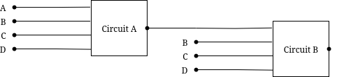

= Lab 05 - Combinatorial Logic
:source-highlighter: highlight.js
:highlightjs-languages: verilog
:icons: font
:last-update-label!:
:toc:

xref:class.zip[Download Class Materials]

== Introduction

In this week’s lab, we will investigate more advanced combinatorial
logic equations and circuits. Now that you have the beginnings of
understanding when it comes to Verilog, we can help you learn more in
depth on the usage of verilog and digital logic.

One of the defining characteristics of combinatorial logic is to be able
to develop subsystems and click them together like Lego. If each module
declares its inputs and outputs, you can mix and match them together to
build up more and more complex functionality out of these building
blocks. To complete this lab, you will do just this, combining all the
functional blocks you have built into one larger system.

To do this, I will introduce the concept of `top level` RTL blocks.
You can think of these like the main function in other programming
languages, it’s the entry point, as such even though there is no
execution sequence like in software programming, where one instruction
executes before another. The top level file will always combine all
functional blocks in a design and map them to the hardware.

*BEFORE YOU CONTINUE*: Please read xref:how_to_verilog.adoc[how to
verilog] to learn about syntax, top level modules, and general Verilog
guidance.

[[circuit-a]]
== Part 1: Circuit A

Given the following truth table:

[cols=",,,,",options="header",]
|===
| A | B | C | D | Y
| 0 | 0 | 0 | 0 | 0
| 0 | 0 | 0 | 1 | 1
| 0 | 0 | 1 | 0 | 0
| 0 | 0 | 1 | 1 | 1
| 0 | 1 | 0 | 0 | 0
| 0 | 1 | 0 | 1 | 1
| 0 | 1 | 1 | 0 | 0
| 0 | 1 | 1 | 1 | 1
| 1 | 0 | 0 | 0 | 0
| 1 | 0 | 0 | 1 | 0
| 1 | 0 | 1 | 0 | 0
| 1 | 0 | 1 | 1 | 0
| 1 | 1 | 0 | 0 | 0
| 1 | 1 | 0 | 1 | 0
| 1 | 1 | 1 | 0 | 0
| 1 | 1 | 1 | 1 | 0
|===

Implement the circuit using Maxterms. Place the equation in the file called
`circuit_a.v`.

[[circuit-b]]
== Part 2: Circuit B

Given the following truth table:

[cols=",,,,",options="header",]
|===
| A | B | C | D | Y
| 0 | 0 | 0 | 0 | 1
| 0 | 0 | 0 | 1 | 0
| 0 | 0 | 1 | 0 | 0
| 0 | 0 | 1 | 1 | 0
| 0 | 1 | 0 | 0 | 1
| 0 | 1 | 0 | 1 | 0
| 0 | 1 | 1 | 0 | 1
| 0 | 1 | 1 | 1 | 0
| 1 | 0 | 0 | 0 | 1
| 1 | 0 | 0 | 1 | 0
| 1 | 0 | 1 | 0 | 0
| 1 | 0 | 1 | 1 | 0
| 1 | 1 | 0 | 0 | 1
| 1 | 1 | 0 | 1 | 1
| 1 | 1 | 1 | 0 | 1
| 1 | 1 | 1 | 1 | 1
|===

Implement the circuit using Minterms. Place the equation in the file called
`circuit_b.v`.

[[toplevel]]
== Part 3: Connecting the Circuits

The next step in this lab is to connect circuit A to circuit B. In our case, we
are saying that input A of circuit B is actually the output of circuit A. In
short, it looks like this:

This gives us an IO table that looks something like this:

=== IO Table
[cols=",,",options="header",]
|===
|Pin |Purpose |Direction
|sw[0] |Circuit A: Input A |IN
|sw[1] |Circuit A: Input B |IN
|sw[2] |Circuit A: Input C |IN
|sw[3] |Circuit A: Input D |IN
|sw[4] |Circuit B: Input B |IN
|sw[5] |Circuit B: Input C |IN
|sw[6] |Circuit B: Input D |IN
|led[0] |Circuit A: Output |OUT
|led[1] |Circuit B: Output |OUT
|===

Notice how Circuit B has no Input A, that's because we are using the output of
Circuit A as the first input of Circuit B. Implement this connection in the file
`top.v`.

Notice how A, B, C, and D of each circuit only gets meaning when we assign them
by instantiating an instance of each module. This means several very cool
things:

. We can reuse these in future designs
. They can fit on any FPGA as long as we can map the inputs
. We can instantiate *many* of each design, giving different switches and LEDs
  to each as we see fit

<<constraints>>
== Part 4: Constraining our design

.Basys3 Schematic
image::img/basys_schematic.png[Basys3 Schematic]

Each pin on the FPGA has a name the FPGA understands. In the case of the Basys3
board designed by digilent, that means the thing we know as SW0 is connected to
the FPGA pin V17. This was decided by the engineers who did the hardware
engineering and board layout for the Basys3.

So, our pin-to-function mapping has been decided by Digilent. How do we
tell Vivado that we mean V17 when we say SW0? Constraints. Open up the
included `constraints.xdc` file. This was provided for you in the previous
lab, but you won’t get so lucky twice. This file is directly taken from
Digilent’s own github repo, where they publish the default mappings for
all of their boards,
https://github.com/Digilent/digilent-xdc/blob/master/Basys-3-Master.xdc[here].

What does this file actually say and mean? Let’s look at one line here:

....
#set_property -dict { PACKAGE_PIN V17   IOSTANDARD LVCMOS33 } [get_ports {sw[0]}]
....

It’s most simply read right to left. `get_ports` will pull a name from
your top level RTL file (in our case, `top.v`) and then operate on it.
We then call `set_property` on that pin, passing in a dictionary
(key/value pairs) of properties:

* `PACKAGE_PIN V17` - This sets the `PACKAGE_PIN`, or the physical
location of `sw[0]` to V17.
* `IOSTANDARD LVCMOS33` - This sets the `IOSTANDARD`, or the voltage
level standard of the pin to `LVCMOS33`. Read more about voltage
standards
https://en.wikipedia.org/wiki/Logic_level#Logic_voltage_levels[here].
Effectively, we are declaring this to be a 3.3V logic level pin.

There are a ton of other things that can be done in these statements, but for
the most part, during this lab, you will be simply uncommenting the lines that
correspond to your design and making sure the names match to your top level
file. Go through the `constraints.xdc` file and uncomment all the I/O pins we
need, based on the IO table in the section above.

== Lab Deliverables

=== Summary of IO Table
[cols=",,",options="header",]
|===
|Pin |Purpose |Direction
|sw[0] |Circuit A: Input A |IN
|sw[1] |Circuit A: Input B |IN
|sw[2] |Circuit A: Input C |IN
|sw[3] |Circuit A: Input D |IN
|sw[4] |Circuit B: Input B |IN
|sw[5] |Circuit B: Input C |IN
|sw[6] |Circuit B: Input D |IN
|led[0] |Circuit A: Output |OUT
|led[1] |Circuit B: Output |OUT
|===

=== Required modules to implement
. Implemented equation for Circuit A in `circuit_a.v` described in
link:#circuit-a[this section]
. Implemented equation for Circuit b in `circuit_b.v` described in
link:#circuit-b[this section]
. Filled out `constraints.xdc` as described in link:#constraints[this section]
. Combine the two circuits above into a `top.v` using the IO table above and
  described in link:#toplevel[here].
. Demonstrate the combined design to TA or lab professor
