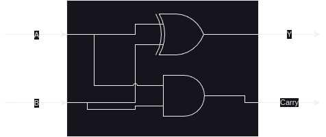
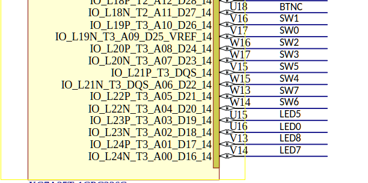

= Lab 05 - Combinatorial Logic
:source-highlighter: highlight.js
:highlightjs-languages: verilog
:icons: font
:last-update-label!:
:toc:

xref:class.zip[Download Class Materials]

== Introduction

In this week’s lab, we will investigate more advanced combinatorial
logic equations and circuits. Now that you have the beginnings of
understanding when it comes to Verilog, we can help you learn more in
depth on the usage of verilog and digital logic.

We will be building a few more complicated circuits and discuss more
about the physical structures of modern logic circuits, as well as
real-life applications.

One of the defining characteristics of combinatorial logic is to be able
to develop subsystems and click them together like Lego. If each module
declares its inputs and outputs, you can mix and match them together to
build up more and more complex functionality out of these building
blocks. To complete this lab, you will do just this, combining all the
functional blocks you have built into one larger system.

To do this, I will introduce the concept of `top level` RTL blocks.
You can think of these like the main function in other programming
languages, it’s the entry point, as such even though there is no
execution sequence like in software programming, where one instruction
executes before another. The top level file will always combine all
functional blocks in a design and map them to the hardware.

*BEFORE YOU CONTINUE*: Please read xref:how_to_verilog.adoc[how to
verilog] to learn about syntax, top level modules, and general Verilog
guidance.

=== Stairway Lights[[stairway-lights]]

To start, let’s look at a contrived example. Imagine we want a to
control a light switch from two different places – like on a stairway,
where one switch is at the top of the stairs and the other at the
bottom. Initially, we may want to hook things up like this:

.stair switches off
image::img/stair_switch_off.png[stair switches off]

Say you wanted to go upstairs to bed. You would turn on the downstairs
switch, and begin walking up the stairs. This will connect the power
source through the switch and turns the bulb on:

.stair switch on
image::img/stair_switch_down_on.png[stair switch on]

You walk upstairs and flip the upstairs switch. This connects the power
source through the switch and… well. Shoot. You can’t turn the light
off! No matter what you do, no matter what state the upstairs switch is
in, the light remains on. The state table for our light looks rather a
lot like that of the OR gate:

[cols=",,",options="header",]
|===
|Down |Up |Stair Light
|0 |0 |0
|0 |1 |1
|1 |0 |1
|1 |1 |1
|===

Where if either switch is on, regardless of the other, the light is on.
Obviously, this is _not_ the behavior we want. Rather, we want this
style of behavior:

[cols=",,",options="header",]
|===
|Down |Up |Stair Light
|0 |0 |0
|0 |1 |1
|1 |0 |1
|1 |1 |0
|===

Where if only one of the two switches is on, _but not both_ the light
will be lit. In a house, we would wire this up like this:

.xor light switch
image::img/xor_switch.png[xor light switch]

Now, as we can see, if we were to flip the downstairs switch, there
would be a path from the power through the switches, through the light,
then to ground. And, when we get upstairs and flip that switch, the
circuit is interrupted and the light goes out. You may notice, by
comparing to previous week’s lab, that this is the XOR truth table. This
is a real example of how various logic equations can be used in the real
world to solve actual problems.

*TASK*: The file `light.v` includes the skeleton of a Verilog module for
you to implement. Go ahead and declare two inputs: `downstairs` and
`upstairs` as well as one output `stair_light`. Then, using the syntax
learned in the previous lab, implement this XOR light switch equation.
Set this up in your top level file with the following input/output
table:

[cols=",,",options="header",]
|===
|Pin |Purpose |Direction
|sw[0] |Downstairs light switch |IN
|sw[1] |Upstairs light switch |IN
|led[0] |Stairway light |OUT
|===

=== Let’s go bigger

____
Cool… so we can turn a stairway lightbulb on and off

- You, probably.
____

Yes, actually, that is super cool. In fact, it is _foundational_ cool,
and I will show you how throughout the rest of this lab.

What if I told you that this light switch system is actually doing math?
I know it sounds like a stretch, but let’s walk through this. You ever
heard the joke "There are 10 kinds of people in this world, those who
understand binary and those who don’t"? We’re going to get you into
that first category here.

The way we normally do math is in a system called Base Ten. That means
there are ten different numbers in each digit. In our case, we represent
them with the numbers 0 through 9. Since there are ten values in each
digit, each place contains 10x the value of the previous, we call these
the *one’s place*, *ten’s place*, *hundred’s place*, and so on:

....
1234
^^^^
|||└-: One's place
||└--: Ten's place
|└---: Hundred's place
└----: Thousand's place
....

That is to say: the decimal number 20 is 10 larger than 10. Even though
we changed that number by a 1, it was in the tens place, so it got 1 *
10 bigger. Each number in a place is multiplied by its digit. So a 1 in
the Thousand’s place is actually worth 1000, not 1. This may seem like a
whole lot of words to explain the readily obvious. But it is important
we get down to the foundation of how a number represents its values in
its digits, because we’re about to switch bases. Computers think in
binary, or Base Two. That means each digit can only contain two values:
0 and 1. That means we don’t have the One’s, Ten’s, Hundred’s, etc
digit, we have the One’s, Two’s, Four’s, Eight’s, Sixteen’s, etc.
Because each digit is 2x as large as the last, as opposed to 10x with
Base Ten.

....
0101
^^^^
|||└-: One's place
||└--: Two's place
|└---: Fours's place
└----: Eight's place
....

So just as we can get the value of `1234` as
`(4 * 1) + (3 * 10) + (2 * 100) + (1 * 1000)`, we can ge the value of
`0101` as `(1 * 1) + (0 * 2) + (1 * 4) + (0 * 8)`, or 5. Of course, 1234
is already decimal so it is fairly trivial for us to understand the
value because we’re used to thinking in it, but it still proves the
point.

What on earth does this have to do with our light switch, though? Let’s
consider a _single digit_ binary number. As we’ve described above, given
it is Base Two, it can have two states: 0 or 1. Well… our light can
either be off or on, so that maps pretty well. We can represent the
state of our stair light with a single binary digit. What is `0 + 1` in
binary? Thankfully this is exactly as straightforward as it looks: `1`.
However, what happens if we do `1 + 1` – well, now we get to the
punchline of our joke, because that’s `10`. Just like when you add
`9 + 1 = 10` in decimal, we move to the next digit, since we are past
the end of our base. `9 + 1` is actually `0, carry the 1`. That means,
if we only have a single binary digit, `1 + 1 = 0`, since we can’t carry
the 1 to the next digit. Let’s look at the results of a single digit
binary summation in a table, where we are doing `A + B = Y`:

[cols=",,",options="header",]
|===
|A |B |Y
|0 |0 |0
|0 |1 |1
|1 |0 |1
|1 |1 |0
|===

You may notice something: that’s the output table for our properly wired
switch from above. So, long winded explanation aside, the XOR switch
pattern for our stair light is doing binary addition of a single digit.
It is _doing math_.

=== Basic Adder[[basic-adder]]

Some of you have likely noticed at this point that the lab is titled
_Combinatorial Logic_, yet we have only *combined* one logic gate here
today. I promised some *more advanced combinatorial logic equations and
circuits*, and you’re right to demand them! Let’s add one more thing
into our… adder. Just how when doing addition in Base Ten we carry out
to the next digit where `9 + 1 = 0 + carry the 1`, we do the same in
binary. Let’s look at the full truth table for an adder `A + B = Y`:

[cols=",,,",options="header",]
|===
|A |B |Y |Carry
|0 |0 |0 |0
|0 |1 |1 |0
|1 |0 |1 |0
|1 |1 |0 |1
|===

If we isolate just the carry bit, the table looks like this:

[cols=",,",options="header",]
|===
|A |B |Carry
|0 |0 |0
|0 |1 |0
|1 |0 |0
|1 |1 |1
|===

Which, if you look at last week’s lab, is the AND gate. That means we
can have a single digit binary adder that looks like this:

.one bit adder

Where the logic equations are:

....
Y = A ^ B;
Carry = A & B;
....

*TASK:* You probably know what’s coming now. There’s an `adder.v` file
with a stubbed out module for you to implement. Fill out the required
equations and complete the implementation of the single bit adder. Wire
this up in your top level module according to the following I/O table:

[cols=",,",options="header",]
|===
|Pin |Purpose |Direction
|sw[2] |A for one bit adder |IN
|sw[3] |B for one bit adder |IN
|led[1] |Y (sum output) of one bit adder |OUT
|led[2] |Carry out of one bit adder |OUT
|===

=== Full Adder[[full-adder]]

This lab is all about combinatorial logic, so let’s slam two of these
together to add two bit numbers together instead. We will call these
four bits (two bits per number, two numbers) A, B, C, D:

....
B A  +  D C
....

I have assigned them in least to most significant digit to make the
following diagrams easier to read.

.can’t fit won’t fit
image::img/cascade_fail.png[can’t fit won’t fit]

Well… what on earth do we do with the carry signals? There’s nowhere to
put them, the second adder summing B + D cannot take into account the
carry from the previous bit. If we look at the what this means, let’s
add the numbers `11 + 01`:

....
B A     D C
1 1  +  0 1

A + C = 0, carry 1
B + D = 1, carry 0

11 + 01 = 10
....

Sadly for our nice little two bit adder, this answer is completely
wrong. Thankfully, we can return back to our decimal addition from
elementary school for inspiration:

....
Step 1:
     v
C    
    12
+   19
------

9 + 2 = 11, or 1, carry the 10

Step 2:
    v
C   1
    1
+   11
------
1 + 1 + 1 = 3

= 31
....

Step 2 above has our secret. Notice how we combine the carry-out from
the previous number (9 + 2) over on top of our second number (1 + 1).
Therefore, to get the second digit in our base ten sum above, we
actually needed to add _three_ different numbers together, the ten’s
place from 12 and 19, as well as the carry from the 9 + 2.

All we have to do is the same to our 1-bit adder – instead of summing
just one bit from each number, we also need to include the carry in from
the previous digit. In other words, we need to sum three bits together.

*TASK:* The truth table for this is below. Implement it in the file
`full_adder.v`. Cin means carry in, and Cout means carry out. You can
think of this as two three-input equations, one where `Y` is composed of
`A`, `B`, and `Cin` and the other where `Cout` is composed of the same.
You can use KMaps to find these equations.

[cols=",,,,",options="header",]
|===
|A |B |Cin |Y |Cout
|0 |0 |0 |0 |0
|0 |0 |1 |1 |0
|0 |1 |0 |1 |0
|0 |1 |1 |0 |1
|1 |0 |0 |1 |0
|1 |0 |1 |0 |1
|1 |1 |0 |0 |1
|1 |1 |1 |1 |1
|===

Then, wire it up in your top level module according to the following I/O
table. You will need two instances of a 1 bit full-adder to add two bit
numbers together:

.full_adder_bd

[cols=",,",options="header",]
|===
|Pin |Purpose |Direction
|sw[4] |LSB of A for two bit adder |IN
|sw[5] |MSB of A for two bit adder |IN
|sw[6] |LSB of B for two bit adder |IN
|sw[7] |MSB of B for two bit adder |IN
|led[3] |LSB of two bit sum |OUT
|led[4] |MSB of two bit sum |OUT
|led[5] |Carry out of MSB adder |OUT
|===

== Constraining our design

.Basys3 Schematic

So, our pin-to-function mapping has been decided by Digilent. How do we
tell Vivado that we mean V17 when we say SW0? Constraints. Open up the
included `constraints.xdc` file. We glossed over this one in the last
lab, but you won’t get so lucky twice. This file is directly taken from
Digilent’s own github repo, where they publish the default mappings for
all of their boards,
https://github.com/Digilent/digilent-xdc/blob/master/Basys-3-Master.xdc[here].

What does this file actually say and mean? Let’s look at one line here:

....
#set_property -dict { PACKAGE_PIN V17   IOSTANDARD LVCMOS33 } [get_ports {sw[0]}]
....

It’s most simply read right to left. `get_ports` will pull a name from
your top level RTL file (in our case, `top.v`) and then operate on it.
We then call `set_property` on that pin, passing in a dictionary
(key/value pairs) of properties:

* `PACKAGE_PIN V17` - This sets the `PACKAGE_PIN`, or the physical
location of `sw[0]` to V17.
* `IOSTANDARD LVCMOS33` - This sets the `IOSTANDARD`, or the voltage
level standard of the pin to `LVCMOS33`. Read more about voltage
standards
https://en.wikipedia.org/wiki/Logic_level#Logic_voltage_levels[here].
Effectively, we are declaring this to be a 3.3V logic level pin.

There are a ton of other things that can be done in these statements,
but for the most part, during this lab, you will be simply uncommenting
the lines that correspond to your design and making sure the names match
to your top level file.

Go through the `constraints.xdc` file and uncomment all the I/O pins we
need, based on the table we generated above. Once you are done, it will
be time to start connecting modules together. To do this, we will take
advantage of the modularity of Verilog. It’s in the name of the syntax
we use to write the files, which gives a hint to their intended use.
Each `module` declares its inputs and outputs immediately in its
instantiation. You can use these in other files, much like we saw in
`test.v` during last week’s lab.

== Lab Deliverables

=== Summary of IO Table
[cols=",,",options="header",]
|===
|Pin |Purpose |Direction
|sw[0] |Downstairs light switch |IN
|sw[1] |Upstairs light switch |IN
|sw[2] |A for one bit adder |IN
|sw[3] |B for one bit adder |IN
|sw[4] |LSB of A for two bit adder |IN
|sw[5] |MSB of A for two bit adder |IN
|sw[6] |LSB of B for two bit adder |IN
|sw[7] |MSB of B for two bit adder |IN
|led[0] |Stairway light |OUT
|led[1] |Y (sum output) of one bit adder |OUT
|led[2] |Carry out of one bit adder |OUT
|led[3] |LSB of two bit sum |OUT
|led[4] |MSB of two bit sum |OUT
|led[5] |Carry out of MSB adder |OUT
|===

=== Required modules to implement
. Implemented light switch module in `light.v` described in
link:#stairway-lights[this section]
. Implemented single bit adder in `adder.v` described in
link:#basic-adder[this section]
. Implemented full adder in `full_adder.v` described in
link:#full-adder[this section]
. Combine the three blocks above with the IO table provided in
link:#full-adder[this section]
. Demonstrate the combined design to TA or lab professor
