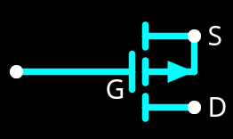
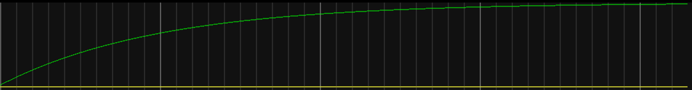

= Delays and Glitches
:source-highlighter: highlight.js
:highlightjs-languages: verilog
:revealjs_theme: simple
:revealjs_width: 1600
:revealjs_height: 900
:revealjs_margin: 0.05
:customcss: img/extra.css
:last-update-label!:
:icons: font
:stem: latexmath

== Distance Delays

image::img/simple_circuit.png[]

Let's say we toggle that switch at 1 GHz

=== Speed of Light

[stem]
++++
\frac{300,000,000 m/s}{1,000,000,000 Hz} = 0.3 m
++++

=== CPU Physical Layout

== Gate Delays

image::img/inverter_circuit.png[]

=== Gate Charge Delay

Gate appears as a capacitor

=== Lumped Element Model

image::img/lumped_gate.png[]

What the gate looks like lumped element

=== Charge Waveform

== Updating the Simulation

[.big-code]
[source,verilog]
----
include::src/delays.v[]
----

== Vivado Demo