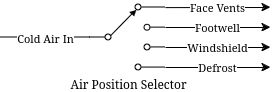

= Lab 08 - Mux and Demux
:source-highlighter: highlight.js
:highlightjs-languages: verilog
:icons: font
:toc:
:last-update-label!:

xref:class.zip[Download Class Materials]

== Introduction

In this week’s lab, we will be learning about two more foundational
components in Structural Verilog – the multiplexer and demultiplexer.
The names sound complicated, but the actual theory of operation is
extremely simple, as usual, I am going to start with a contrived example
and go from there.

=== A Contrived Example

Let’s take for example a car. In nearly all cases, this car will have a
single air conditioning condenser, the thing that actually gets cold to
chill the air entering the vehicle cabin. Side note: heat pumps are
https://en.wikipedia.org/wiki/Heat_pump[very cool] and you should learn
about them since they’re everywhere.

Anyway, you have a single stream of cold air coming into the HVAC
system… but how does it get to the footwell? Or the face vents? Or maybe
even the defroster? Well, there’s that dial you can turn that changes
where the stream of air goes. Depending on the car, this might move
flaps with vacuum or electric motors, or any number of other methods –
but at the end of the day, this is acting as a demultiplexer:

.HVAC position selector

We can see a single input coming in, and some kind of switching that
routes that output to one of many different output ports. Multiplexing
is the opposite operation, many separate inputs being routed via some
switch to a single output. In the context of our Verilog problems, these
would be incoming signals (of any width) to an output signal (or vice
versa for demultiplex).

In our systems, instead of a physical dial to select the output (or
input), there’s typically a set of selector bits and an enable line.
There are enough selector bits to describe which output (or input) to
select, that is 1 bit for a 2-MUX, 2 bits for a 4-MUX, 3 bits for an
8-MUX, and so on. The enable line disables the outputs entirely when
deasserted, and enables normal operation when asserted.

Let’s take for example a simple 1 bit wide two input mux. We want to be
able to chose which of the two input signals we assign to the output. We
can describe it like this:

[source,verilog]
----
module simple_2_mux(
    input A, B, Sel, Enable,
    output Y
);

    assign Y = (A & ~Sel | B & Sel) & Enable;

endmodule
----

Now, we can display its truth table like this:

[cols=",,",options="header",]
|===
|Sel |Enable |Y
|0 |1 |A
|1 |1 |B
|X |0 |0
|===

The demultiplexer would do the opposite, assigning `Y` into `A` or `B`
depending on `Sel`. Similarly, 1 bit wide four input mux would look like
this:

[source,verilog]
----
module simple_4_mux(
    input [1:0] Sel,
    input A, B, C, D, Enable,
    output Y
);

    assign Y = (A & ~Sel[0] & ~Sel[1] |
                B &  Sel[0] & ~Sel[1] |
                C & ~Sel[0] &  Sel[1] |
                D &  Sel[0] &  Sel[1] |) & Enable;

endmodule
----

You can see here that the binary representation of `Sel` is used to
select a particular input. We simply count from `00` to `11` with `Sel`
to pick `A` through `D`. This scales all the way up as far as you want
to go. However… what do we do when we want more than a single bit
multiplexed in? We could do this:

[source,verilog]
----
module simple_2_mux_2_bits(
    input [1:0] A, [1:0] B,
    input Sel,
    output [1:0] Y
);

    simple_2_mux bit0 (
        .Enable(1),
        .A(A[0]),
        .B(B[0]),
        .Sel(Sel),
        .Y(.Y[0])
    );

    simple_2_mux bit1 (
        .Enable(1),
        .A(A[1]),
        .B(B[1]),
        .Sel(Sel),
        .Y(.Y[1])
    );

endmodule
----

… and so on for more bits. But, that doesn’t scale well. It feels
clumsy, and while it is very structural and compositional there are
better ways to do these things. Introducing… _the conditional operator_.
You may be somewhat familiar with these from other languages like C or
Java where they are called Ternary Statements. Let’s look at one of them
in Verilog below:

[source,verilog]
----
module ternary_2_mux(
    input Sel,
    input A, B, Enable,
    output Y
);

    assign Y = (Sel ? B : A) & Enable;

endmodule
----

They work like this: `Condition ? True statement : False statement`. We
can use this to our advantage in the higher bit count muxes. Let’s see
what the same 2 bit wide 2 input mux from above would look like with
conditional operators:

[source,verilog]
----
module ternary_2_mux_2_bits(
    input [1:0] A, [1:0] B,
    input Sel,
    output [1:0] Y
);

    assign Y = (Sel ? B : A);

endmodule
----

Woah! We don’t have to decompose our input signals! We assign the entire
vector of `A` or `B` into the output vector of `Y`. When the width of
signals matches well, the conditional statement is one of the best
methods to do assignments like this.

What kinds of things would we use multiplexers and demultiplexers for?
Likely the most common application is bus arbitration within CPUs or
other similar circuits. However, this is a fairly advanced topic, so we
will stick with a more contrived example – a really terrible Internet
Service Provider.

*Hint:* For the higher count multiplexers, like the 4-MUX, the
conditional statement will have to evaluate the value of the select
vector. There are multiple ways to do this in verilog:

[source,verilog]
----
module equivalence_check(
    input [1:0] select,
    output is_zero, is_one, is_two, is_three
);
    // Option one:
    assign is_zero  = ~select[0] && ~select[1]; // 0b00
    assign is_one   =  select[0] && ~select[1]; // 0b01
    assign is_two   = ~select[0] &&  select[1]; // 0b10
    assign is_three =  select[0] &&  select[1]; // 0b11

    // Option two:
    assign is_zero  = select == 0;
    assign is_one   = select == 1;
    assign is_two   = select == 2;
    assign is_three = select == 3;
endmodule
----

Notice the `&&` instead of `&`. The result of `&` is the two numbers
bitwise-and’ed together. The result of `&&` is a boolean operation. If
both sides of the `&&` are `true` (that is, nonzero), then the output
is also true.

=== Part 1

In this scenario you are an employee at Monopolistic Communications
Company. You are the sole provider of internet in your town, and your
boss has tasked you with updating the internet infrastructure. Right
now, there’s only a single line, connecting the CEO of the company to
the local Library:

[source,txt]
----
CEO --> Library
----

Apparently, the townsfolk (all three of them, including you), aren’t
happy with this situation. They all want to be able to connect to the
library too! To do this, the CEO has asked you to install an Internet
Valve that people can go out and switch the connection from their house
onto the line. The internet connection here is slow, of course, and is
only four bits of data. By the end, you will need to be able to move the
four bits from the CEO, and the three other residents onto the internet
line to the Library, like so:

[source,txt]
----
CEO ----┐
You ----|
Fred----├--->Library
Jill----┘
----

Hey! That looks a lot like a multiplexer…

=== Part 2

In a shock to no one (as we’ve only used a multiplexer not a
demultiplexer), the three other businesses in the town, the School, Fire
Department, and Rib Shack also want to be able to receive information
from the townsfolk. You’ve been asked by the CEO to now add another
Internet Valve to switch the data from the townsfolk and into a given
business, like so:

[source,txt]
----
CEO ----┐     ┌---->Library
You ----|     |---->Fire Department
Fred----├-----┤---->School
Jill----┘     └---->Rib Shack
----

The demultiplexer is the reverse of the multiplexer. It takes input of a
given width (four bits in our case) and assigns it to one of (2^N)
outputs where N is the width of select (in our case, two bits and four
outputs). It will use logic that is the reverse of the multiplexer,
where instead of a single assign statement with chained ternaries, it
will use four assign statements with single ternaries.

Here’s an example of a two bit wide, two output demux:

[source,verilog]
----
module demux(
    input [1:0] In,
    input Sel,
    output [1:0] Y1,
    output [1:0] Y2
);

    assign Y1 = (Sel == 1'b0 ? In : 0); // Drive Y1 if Sel == 0
    assign Y2 = (Sel == 1'b1 ? In : 0); // Drive Y2 if Sel == 1

endmodule
----

=== Implementation

Wire your multiplexer into your demultiplexer to make the full internet
system, as shown below.

The IO table is as follows:

[cols=",,",options="header",]
|===
|Signal |Purpose |Direction
|sw[3:0] |CEO data |IN
|sw[7:4] |Your data |IN
|sw[11:8] |Fred’s data |IN
|sw[15:12] |Jill’s data |IN
|btnL |Sel[0] of the multiplexer |IN
|btnU |Sel[1] of the multiplexer |IN
|btnD |Sel[0] of the de-multiplexer |IN
|btnR |Sel[1] of the de-multiplexer |IN
|btnC |Enable of the multiplexer/de-multiplexer |IN
|led[3:0] |Data at the library |OUT
|led[7:4] |Data at the fire department |OUT
|led[11:8] |Data at the school |OUT
|led[15:12] |Data at the rib shack |OUT
|===

*NOTE:* DO NOT USE THE TERM `library` in your verilog code. This is a
reserved keyword. Use `local_lib` instead.

The idea behind this is that you should be able to set the four switches
of data corresponding to any given sender, then press & hold a
combination of BTNL/U to select the source of data to the library, and
see that set of LEDs light up.

With this setup you should now be able to not only switch who is
sending, but who is receiving the four bits.

=== Lab Deliverables

* A completed design with the above multiplexing and demultiplexing
* Demonstrate the design on the Basys3 board to the lab instructor or TA

=== Appendix A: Chaining Ternary Statements

For the above solutions, you will need to chain three ternary statements
to make things work. Here’s a quick example of this:

[source,verilog]
----
module chaining_ternaries(
    input [1:0] sel,
    output [1:0] Y
);

    assign Y = sel == 'b00 ? 'b00 : // If 0, then... else
                sel == 'b01 ? 'b01 : // If 1, then... else
                sel == 'b10 ? 'b10 : 'b11; // If 2, then... else
                // We end here and do not use a fourth ternary
                // because 1:0 bits can only be 0, 1, 2, 3
                // and the else case of the third ternary can
                // only be 3

endmodule
----

=== Appendix B: Concatenation

For this lab, you will need to combine scalars (the buttons) into a
vector for the select logic. There are many ways to do this:

[source,verilog]
----
module concat(
    input btnU, btnD
);

    // Method 1: brute force
    wire [1:0] brute;
    assign brute[0] = btnU;
    assign brute[1] = btnD;

    wire [1:0] concat;
    // Method 2: concat structured assignment:
    //               1  :  0
    //               v     v
    assign concat = {btnD, btnU}; // NOTE: Pay VERY VERY close
                                  // attention to your order

endmodule
----
