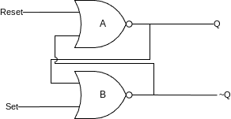
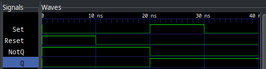
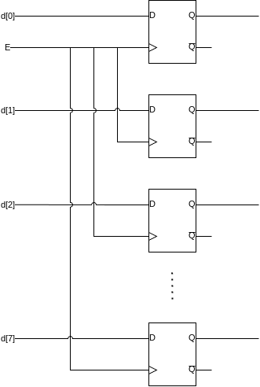
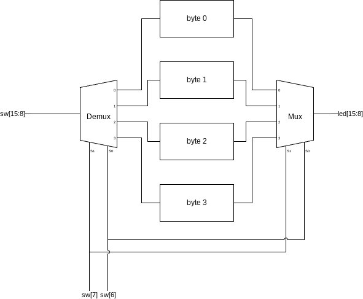
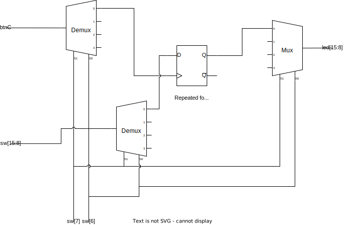
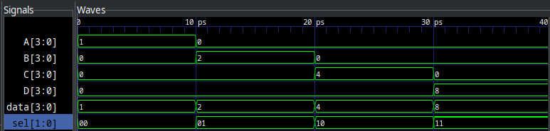
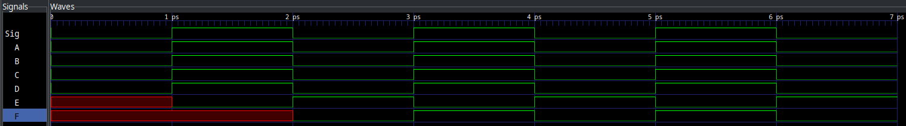

= Lab 09 - Synchronous Circuits
:source-highlighter: highlight.js
:highlightjs-languages: verilog
:icons: font
:toc:
:last-update-label!:

xref:class.zip[Download Class Materials]

In this lab we will broach the last foundational topic within RTL and digital logic design -- that of Synchronous Logic. Prior to this, we have only utilized continuous assignment, wherein the output of a circuit immediately reacts to the change in any of its inputs, but this is a very limiting constraint. Everything hereafter will be compositions of structural Verilog, continuous assignment, behavioral Verilog, and Synchronous assignment.

All more complicated digital designs, like that for the CPU in the device on which you are reading this lab, require carefully synchronized changes in the various modules in order to function. And more than that, they need certain values to persist throughout time to be used and reused later. Both of these concepts rely on synchronous logic.

WARNING: This class, please use the constraints file as-is. It contains an additional instruction to Vivado at the bottom to allow your D-Latches to implement.

WARNING: This lab has some new syntax required to implement all the features. Please read all appendixes at the bottom of this document for examples and explanations.

== Synchronous Logic

You deal with synchronous systems all the time. I imagine you've even done so very recently, maybe to log into GitHub and get things ready for this lab -- the login page.

GitHub would be a really poor website if it instantly tried to log you in on every key press, saying "wrong password" each time you entered a character until you finished typing. No -- it *waits* for you to hit the enter key or press the Login button to look at its inputs. That event, either the keyboard or UI, is the synchronous event that triggers the system to operate.

To bring the concept down to the labs/board we have been using, think back to the Multiplexer/Demultiplexer lab, where you had the really crappy "ISP" set up to send data from one of four places to any one of four other places. The CEO, for instance, could not wait to send their data until they had decided on a pattern for the four switches -- that data was always available. And unless you can, in the exact same instant, flip all four switches then intermediary data is making it out on the bus.

See here an example to clarify:

.How it is now
[plantuml]
....
include::img/current_state.puml[]
....

We can see as the CEO is changing the switches, there's a period of time where the wrong values are going out on the bus! In this instance, it is the time highlighted by "Changing", and the values 1 and 5 are not the desired 13.

.How we want it to be
[[how_we_want]]
[plantuml]
....
include::img/synch_state.puml[]
....

So -- how do we get to the state in the second diagram? Well, obviously with synchronous logic (I mean it's even in the title of this section!), but what does that entail?

Well, we have to break the rules we established in week 6 -- we need combinatorial loops! We want to make a light switch we can flip internally in the FPGA, that is an electronically actuated latching circuit. We want to be able to *set* this latch to turn it on, and *reset* this latch to turn it off. Perhaps... we should call it the Set-Reset Latch? I should patent this!

Jokes aside, the solution to this is the SR-Latch, or the Set-Reset Latch. It's a circuit that can be set to on, then reset to off. And, what's important to this circuit, is that if both the set and reset inputs are off, it _holds its state_. Let's see what the output looks like below:

[plantuml]
....
include::img/sr_latch.puml[]
....

NOTE: This unknown state will be a common thing you have to deal with in Synchronous circuits. Before a reset condition, it is physically impossible to know what state a circuit is in. For this reason, we will use reset lines in all of our modules. Vivado notates this with "X" for unknown/don't care. If you see "X" as the value of your signal, it is because it hasn't been set yet.

What does the circuit that behaves like this even _look_ like? Well, as I hinted, it leverages combinatorial loops:

Here, we have two NOR gates looped together. We will call them A (who outputs Q) and B (who outputs ~Q), and their equations are:

.SR-Latch Equations
====
* `A = Q = Reset NOR ~Q`
* `B = ~Q = Set NOR Q`
====

include::src/sr_latch_truth.adoc[]

Why and how on earth does this work, though? It seems really simple, and luckily it is. Let's assume, at `t=0` we have `Q=0` and `~Q=1`. This is known as the "reset" case. Let's look through the timeline of events as we assert the "Set" line:

. NOR gate B has inputs of `0 ~| 0` (from Q and Set) which outputs 1 (~Q)
. NOR gate A has inputs of `0 ~| 1` (from Reset and Q~) which outputs 0
. *SET IS ASSERTED*
. NOR gate B now has inputs `0 ~| 1` from Q and Set respectively
. NOR gate B deasserts its output
. NOR gate A now has inputs of `0 ~| 0` (from Reset and Q~) and asserts its output (Q)
. NOR gate B now has inputs of `1 ~| 1` (from Q and Set) and remains deasserted
. *SET IS DEASSERTED*
. NOR gate B now has inputs of `1 ~| 0` (from Q and Set) and remains deasserted
. Circuit has reached a stable state

We can see from the flow above that asserting Set then deasserting it leaves the circuit flipped -- its Q output remains high and ~Q is now low. More importantly, it will remain this way until you toggle the Reset line. This circuit can store a value without needing its inputs to remain active at all times. The outputs Q and ~Q are _synchronized_ to Set and Reset.

== How to Make It

If you were to go ahead and try to implement the above circuit by literally typing:

[source,verilog]
----
include::src/structural_sr_latch.v[tag=module_source]
----

It will simulate in Icarus Verilog and GTKWave will show you what looks to be the correct output:

Notice how `NotQ` and `Q` remain latched even after the inputs go back to zero? This is memory! The SR-Latch is remembering its state without the inputs needing to remain present. This unlocks very significant and exciting behaviors.

However, if you try to implement this circuit using Vivado and synthesize it for the Basys3, you will run into the same problem as Lab 6 -- where it errors out about the combinatorial loop and will not let you proceed.

Thankfully, we have our answer in Behavioral Verilog! Behavioral Verilog introduces two new features critical to the function of latches and memory, Sensitivity Blocks and the `reg` keyword. `reg` in this case stands for "register", and as the name implies, allows us to synthesize circuits with memory. Sensitivity blocks allow us to specify to the synthesis engine what signals our memory is synchronous to.

Usually, `reg` synthesizes to use flip-flop or register hardware on the device, but in the case of `pass:[always @(*)]` blocks, they can even contain regular continuous assignment wherein no memory is needed. It is just for silly syntax reasons we *must* use `reg` inside of an `always` block... always.

NOTE: Simple rules: If you are inside an `always` block, the signals must be `reg` and you don't use `assign`. If you are *not* in an `always` block, signals must be `wire` and you must use `assign`.

So, let's rewrite our SR-Latch with the new behavioral syntax:

[source,verilog]
----
include::src/behavioral_sr_latch.v[tag=module_source]
----

<1> Notice, we can do something really cool here. I can use some structural continuous assignments to mimick the behavior of the inverted output. It is totally valid, and even common, to mix structural and behavioral Verilog in designs.
<2> The Sensitivity List isn't just a * here, note that since we are synchronous to Set and Reset, we have both in this list.
<3> Notice the *non blocking* assignment, for more see <<block_nonblock>>. Use non blocking for the remainder of the lab. There are very few cases wherein you should use blocking assignment in general.

This will now _behave_ the same, but synthesize correctly in Vivado. However, we have a problem with this design. What if we assert both Set and Reset? Obviously, functionally speaking this has no meaning. How are we supposed to derive the output state given this? The state where Set and Reset are high is known as the "invalid" state of the SR-Latch.

== Where to Go From Here

Obviously, the SR-Latch isn't the end-game of memory and synchronous logic. It has that "invalid" state mentioned above. How do we stop this? The solution to any digital logic problem is always more digital logic. We need to design an interface to the SR-Latch that _cannot_ be in the invalid state. This could take many forms, but in today's lab, we are going to focus on the D-Latch. It has the following truth table:

include::src/d_latch_truth.adoc[]

Or, presented as a waveform:

[plantuml]
....
include::img/d_latch.puml[]
....

Notice how the outputs of Q and ~Q only change while E is high. This circuit is _synchronous_ to E and D, rather than to both S and R as the SR-Latch is. It is impossible to get this into an invalid state.

== Lab Deliverables

=== Part 1: Single Bit Memory

Your mission, should you choose to accept it (note: enrollment in this class is implicit acceptance), is to implement the D-Latch in Behavioral Verilog using the below IO table:

|===
| Signal | Purpose | Direction
| sw[0]  | D       | IN
| btnC   | E       | IN
| led[0] | Q       | OUT
| led[1] | ~Q      | OUT
|===

TIP: Think about the sensitivity list in your `always` block. The output of the D-Latch changes while E is high.

=== Part 2: Four Bytes!

Using the D-Latch you developed above, and the behavioral mux from the previous lab, we're going to implement a very basic computer memory system. Using the same "store" command as above (btnC), we want to make a four byte memory system!

For this, you will need to build several blocks:

. 8-bit memory block
. Data demultiplexer
. Output data multiplexer

The multiplexer block you have already written in previous labs, and this will just be an extension thereof, where we have a four input, 8 bit wide multiplexer, and a four output, 8 bit wide demultiplexer. For the demultiplexer, see <<demultiplex_appendix>>.

The data block is more interesting, see a block diagram below:

.Byte Storage Block Diagram

For your 8 bits of memory, you will use 8 D-Latches with their Enable lines hooked together so they store at at the same time. You are free to implement this however you feel. You can instantiate 8 D-Latches in the module, or create a new D-Latch module that is 8 bits wide. Then, hook up four of them as shown below:

.Data Block Diagram

NOTE: Enable line not shown for brevity. However, it will also need to be demultiplexed into each of the four bytes.

The 8 data bits come in to a demultiplexer, controlled by the address select lines. These feed to the inputs of four 8-bit wide D-Latches. Not shown is another 1 bit multiplexer putting the store line (btnC) into the E line of each of the 8-bit wide D-Latches. The intended behavior of this circuit is to allow the user to select which byte to target, see its output on the LEDs (output bits), then optionally store a new value in that address with the store command (btnC).

|===
| Signal    | Purpose        | Direction
| sw[15:8]  | 8 data bits    | IN
| sw[7:6]   | Address Select | IN
| btnC      | Store          | IN
| led[15:8] | 8 output bits  | OUT
|===

NOTE: Store/Enable are interchangeable terms on D-Latches. You may also call it Enable, as it is equivalent to what we learned in part 1.

NOTE: If you are having trouble, see <<scaffold_appendix>> for some scaffolding to help you get started. To help instantiate multiple blocks, see <<looping_appendix>>.

For additional context, see a zoomed in/cropped design diagram:

=== Summary

|===
| Signal    | Purpose        | Direction
| sw[0]     | SR-Latch D     | IN
| btnC      | SR-Latch E     | IN
| led[0]    | SR-Latch Q     | OUT
| led[1]    | SR-Latch ~Q    | OUT
| sw[15:8]  | 8 data bits    | IN
| sw[7:6]   | Address Select | IN
| btnC      | Store          | IN
| led[15:8] | 8 output bits  | OUT
|===

. Implement an SR Latch as described in Part 1
. Implement the four byte memory system as described in Part 2

[[array_appendix]]
== Appendix 1: Array Syntax

So, we've seen how to declare vectors in Verilog, but there are also arrays. These are distinct from vectors, which are a single signal that is N bits wide, in that they are M signals N bits wide, declared like so:

[source,verilog]
----
wire [N-1:0] arr[M-1:0];
----

To make a 4 element array (M=4) of 8 bit signals (N=8), you would do the following:

[source,verilog]
----
wire [7:0] arr[3:0];
----

And for a reference:

[source,verilog]
----
include::src/arrays.v[tags=module_source;!*]
----

<1> This is a single signal, 8 bits wide
<2> This is four 1 bit signals
<3> This is four 8 bit signals

Now, the confusing part. Since this is Verilog, none of the syntax is allowed to make any sense. Accessing a single bit of a vector is done with the `[x]` operator, where x is the bit or slice you want to access. Now, with vectors, instead of the `[]` taking a single bit, it takes a single signal. See below:

[source,verilog]
----
include::src/arrays.v[tag=access_example]
----

<1> This grabs the third single bit signal in `arr`
<2> This grabs the fourth 8 bit signal in `arr_vec`
<3> This grabs the third signal, then the 8th bit in that signal from `arr_vec`

[[scaffold_appendix]]
== Appendix 2: Module Scaffolding

.byte_memory.v
[source,verilog]
----
include::src/scaffolding.v[tag=byte_mem]
----

.memory_system.v
[source,verilog]
----
include::src/scaffolding.v[tag=mem_system]
----

.d_latch.v
[source,verilog]
----
include::src/scaffolding.v[tag=d_latch]
----

.top.v
[source,verilog]
----
include::src/scaffolding.v[tag=top]
----

[[demultiplex_appendix]]
== Appendix 3: Demultiplexing

.Four output, 4 bit wide demultiplexer
[source,verilog]
----
include::src/demultiplex.v[tag=module_source]
----

<1> Multiplexers are combinatorial logic. `*` is preferred as they require no memory.
<2> We need to assign all other outputs to zero that are not the currently selected output. One way to do this is by concatenating zeros with the input data into the output. Make sure the width of the zeros matches the width of the outputs. In this case, each output is four bits, so we have to pack `4'b0` into them.

.Demux Example Output

For other orders of demultiplexers, the width of the select line and inputs/outputs will be different. Scale accordingly to your design.

[[looping_appendix]]
== Appendix 4: Looping, `genvar`, and `parameter`

When instantiating large numbers of the same block to make a bus, it is often a highly manual effort to name/wire them up. To ease this process, Verilog comes with a concept called a `genvar`, or a "generator variable". These variables are used within `generate` blocks to instantiate module instances or repeated logic. See below for an example:

[source,verilog]
----
include::src/genvar.v[tag=module_source]
----

<1> Declaring a `genvar`, similar to how you would declare a `wire` but can only be used in a `generate block`
<2> Begin a generate block. Make sure to end with `endgenerate`
<3> Use a for loop _almost_ like you would expect in another language. This will loop from `i = 0` through to `i=15`. Note that there is no `++` operator.
<4> Instantiate a block as normal. No need to worry about names colliding, the `generate` block will append an ID to them.
<5> You can use the `genvar` while assigning inputs.
<6> Parameters can be provided to modules, used as design-time constants. They are in a list before the port delcarations and preceded by a "#" character.

In the example above, the parameter has a default value, which means if you instantiate it normally, you will get the default value in the parameter. If you need to specify something different, use the following syntax:

[source,verilog]
----
include::src/genvar.v[tag=module_instance]
----

<1> Notice we provide parameters in a `#()` block before the name, and use the same `.Parameter(Value)` syntax as port list.

[[block_nonblock]]
== Appendix 5: Blocking vs. Non Blocking Assignment

See the example below:

[source,verilog]
----
include::src/block_nonblock.v[tag=module_source]
----

And it outputs the following:

