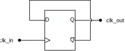
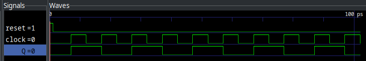

= Flipping And Flopping Our Way To Displays
:source-highlighter: highlight.js
:highlightjs-languages: verilog
:revealjs_theme: simple
:revealjs_width: 1600
:revealjs_height: 900
:revealjs_margin: 0.05
:customcss: img/extra.css
:icons: font

== Level vs Edge Sensitive

=== Level Sensitive

.D-Latch Output
image::img/dlatch_output.png[width=1400px]

=== Edge Sensitive

.Edge vs. Level Sensitivity
[plantuml,format=svg,width=1400]
....
include::src/level_vs_edge.puml[]
....

=== Edge detector and D-FlipFlop

.Pulse Detector and D-Latch
image::img/dff_diagram.drawio.svg[width=1400px]

=== Behavioral Implementation

[.big-code]
[source,verilog]
----
include::src/byte_storage.v[tag=with_ff]
----

== Counters

[.columns]
=== Clock dividers

[.column]

[.column.is-two-thirds]

=== Scanning

image:img/basys3_7seg_anodes.png[width=900px]

== Lab Overview

=== Block Diagram

image:img/lab_block_diagram.drawio.svg[width=800px]

=== Driving Segments

image:img/basys3_7seg_segment.png[width=900px]

=== Video Demo

[.stretch]
video::4SU6DP_Tv3Y[youtube]