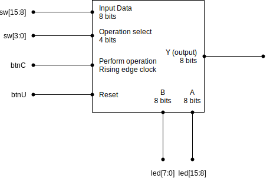

= Lab 12 - ALU design
:source-highlighter: highlight.js
:last-update-label!:
:highlightjs-languages: verilog
:icons: font
:toc:
:stem:

xref:class.zip[Download Class Materials]

// Getting tweaked to be a 4-bit 4 operation ALU
// This 16 operation 8-bit ALU will be included as
// a starting point for the Final
== Introduction

Welcome to the lab final! This assignment will take place over the next several weeks and combine all that you have learned this semester into one functional end product. So, what will we be working on? We will be designing a simple, custom Arithmetic Logic Unit using behavioral verilog. This lab is intentionally going to be significantly more light on details than the previous labs. You're intended to combine what you've learned and the content from this entire semester into one larger functional unit.

== The Arithmetic Logic Unit

A core component of all computers is what is called the Arithmetic Logic Unit, or ALU for short. It is a piece of the CPU that is responsible for actually *doing* all operations, from addition to comparison. In this lab we are going to make a simplistic 8-bit ALU.

Your ALU must have the following external interface:

Internally, it must have two registers A and B, which are both 8 bits wide. Those registers are what the ALU will operate on, and all input values to the various operations will come from A and B (see more in Units below). The reset signal should set A, B, and Y to zero.

=== Arithmetics

Your ALU will have to do the following arithmetic operations:

* Addition
** Y = A + B
* Subtraction
** Y = A - B
* Shift left
** Y = A << 1
* Shift right
** Y = A >> 1

=== Logics

Your ALU will have to do the following logical operations:

* Comparison
** Y = 0 if A = B
** Y = 1 if A > B
** Y = -1 if A > B
* Bitwise AND
** Y = A & B
* Bitwise OR
** Y = A | B
* Bitwise XOR
** Y = A ^ B
* Bitwise NAND
** Y = A ~& B
* Bitwise NOR
** Y = A ~| B
* Bitwise XNOR
** Y = A ~^ B
* Bitwise NOT
** Y = ~A
* Two's Compliment
** Y = -A

=== Units

All numbers in your ALU are signed 8 bit integers, via Two's Compliment.

* Store A
** Store Y in A
* Swap A/B
** A = B, B = A
* Load into A
** Load switches into A

== IO Planning

The IO Table is as follows:

.IO Planning Table
|===
| Pins | Description | Direction
| sw[3:0] | *Operation selector* | IN
| sw[15:8] | 8 *input bits* | IN
| btnC | Do operation | IN
| btnU | Reset | IN
| led[15:8] | Display A value from inside the ALU | OUT
| led[7:0] | Display B value from inside the ALU | OUT
| seg[6:0] | Display segments | OUT
| an[3:0] | Display anodes | OUT
|===

The operation table is as follows:

[[operation_table]]
.Operations Table
|===
| Index | Operation | Short Code
|  0 (0x0)   | Addition | ADD
|  1 (0x1)   | Subtraction | SUB
|  2 (0x2)   | Shift left | SHL
|  3 (0x3)   | Shift right | SHR
|  4 (0x4)   | Comparison | CMP
|  5 (0x5)   | Bitwise AND | AND
|  6 (0x6)   | Bitwise OR  | OR
|  7 (0x7)   | Bitwise XOR | XOR
|  8 (0x8)   | Bitwise NAND | NAND
|  9 (0x9)   | Bitwise NOR | NOR
| 10 (0xA)   | Bitwise XNOR | XNOR
| 11 (0xB)   | Bitwise NOT | INV
| 12 (0xC)   | Twos Compliment | NEG
| 13 (0xD)   | Store A | STO
| 14 (0xE)   | Swap A/B | SWP
| 15 (0xF)   | Load into A | LOAD
|===

.Display Table
|===
| Display | Purpose
| Right | Value of operation selector
| Right Center | N/A
| Left Center | Lower four bits of Y
| Left | Upper four bits of Y
|===

== Theory of Operation

The usage and operation of the ALU is fairly straightforward. You select an operation by flipping the Operation select switches, then invoke the operation by hitting button C. Let's look at a few examples:

NOTE: For all examples "input bits" refers to sw[15:8], and "select operation" refers to sw[3:0]

.Add two numbers 10 + 12
====
. Press bntU to reset
. Select operation `Load into A` (15)
. Dial 10 into input bits (0000 1010)
. Press btnC to load 10 into A
. Select operation `Swap A/B` (14)
. Press btnC to swap A and B
. Select operation `Load into A` (15)
. Dial 12 into input bits (0000 1100)
. Press btnC to load 12 into A
. Select operation `Addition` (0)
. Press btnC to evaluate the addition
. Observe the hex value 16 displayed on the left displays
====

In effect, you as the user physically selecting switches and pressing buttons, are acting as the coordination sections of a real CPU. In a full CPU, there are additional pieces of circuitry that increment through instructions, and the instructions encode the operation to do. In fact, we can represent these steps in something that *almost* looks like assembly code (see the <<operation_table>> for the short codes)!

.Add two numbers (assembly lookalike)
----
DATA 10 # Set input data to 10
OP LOAD # Run load operation
OP SWP # run swap operation
DATA 12 # Set input data to 12
OP LOAD # Run load operation
OP ADD  # Run add operation
----

== Procedure

You will have three weeks to complete this lab. Take your time, come up with a design, reuse components from the previous labs, and have fun!

Think about the following things:

* What blocks will you need?
* Where do you need to multiplex or demultiplex data?
* What memory do you need to use and where will you put it?
* How will you test this design?

NOTE: For the addition, subtraction, and Two's Compliment conversion, please use your implementations from previous labs rather than a behavioral implementation.

== Sample Programs

.Add two numbers
----
DATA 10 # Set input data to 10
OP LOAD # Run load operation
OP SWP # run swap operation
DATA 12 # Set input data to 12
OP LOAD # Run load operation
OP ADD  # Run add operation - Should display 22 on Y (hex 16)
----

.Subtract two numbers
----
DATA 20 
OP LOAD 
OP SWP 
DATA 12 
OP LOAD 
OP SWP
OP SUB # Should display 8 on Y (hex 8)
----

.Simple counter
----
DATA 1
OP LOAD
OP SWP
DATA 0
OP LOAD
OP ADD # Repeat these two steps
OP STO # To keep counting

# To count down do the following
OP SWP
OP NEG
OP STO
OP SWP
OP ADD # Repeat these two steps
OP STO # To keep counting (down)
----

.Comparisons
----
DATA 10
OP LOAD
OP SWP
OP LOAD
OP CMP # Equal (hex 0 on Y)
DATA 11
OP LOAD
OP CMP # Greater (hex 1 on Y)
DATA 9
OP LOAD
OP CMP # Less (hex FF on Y aka -1)
----

.Shifting
----
DATA 2
OP LOAD
OP SHL # Should display hex 4 on Y
OP SHR # Should display hex 1 on Y
----