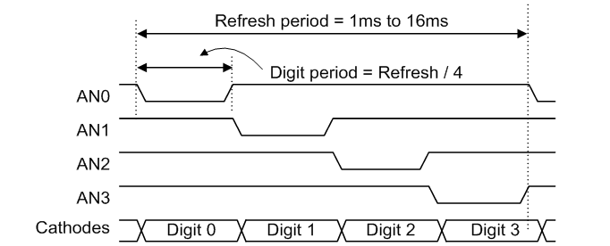

= Lab Final - FlipFlops, Displays, and Math!
:source-highlighter: highlight.js
:highlightjs-languages: verilog
:icons: font
:toc:
:last-update-label!:
:stem:

xref:class.zip[Download Class Materials]

[[flipflop_div]]
== Clock Dividers

Onboard the Basys 3, there is a 100 MHz crystal oscillator. That is, it toggles between high and low, then back to high 100 million times each second. This is an extremely high frequency, too high for many applications (and funnily enough, too low for others -- but that is outside the scope of this class.) Thus, we generally will need to slow down the clock for our application. Thankfully, flipflops are here to save the day again!

Say we have a D-FlipFlop implementation:

[source,verilog]
----
include::src/dff_divider.v[tag=dff_impl]
----

And we hook its `NotQ` output into its `D` output, like so:

image:img/dff_div_diagram.drawio.svg[]

Then we can do the following:

image:img/dff_div_out.png[]

Notice how the `Q` output (or `clk_out` in the diagram) toggles at half the rate of the input clock. We can keep chaining these dividers until we divide the input clock by 2^N^ where N is the number of chained FlipFlops. Then, just take the Q output of the final divider as the output clock. In the case of the Basys3, we have a 100 MHz clock input baked onto the board. If we want this to become a 1 KHz signal (or 1000 times per second), we need to divide it down by some power of two:

stem:[100e^6 -: 2^N ~= 1000]

With N = 16, we get ~1526 Hz and with N = 17 we get ~763 Hz. 763 Hz is closer to 1 KHz than 1526, so the better choice is N = 17. This will give us an output clock frequency that is as close to 1 KHz as a power of two can give us.

NOTE: If you would like, you can also simply chain T FlipFlops, since they automatically have the inversion logic.

[[displaying]]
== 7 Segment Displays

To add some fun to this lab, we are going to visualize things with the Seven Segment display for the first time! It is wired up as a common anode, switched cathode style. See below:

NOTE: For much more detail on this and other things about the Basys3, see https://digilent.com/reference/programmable-logic/basys-3/reference-manual#seven_segment_display[the reference manual]. The following two images are from this web page.

.Common Anode (source: Digilent Reference Manual)
image:img/basys3_7seg_segment.png[]

.Segment Selection (source: Digilent Reference Manual)

Quite conveniently, you can see that the scan rate (Refresh period) is between 1 KHz and 60 Hz, so the division counter we found above works perfectly! What a coincidence... If each digit is lit for stem:[ 1 / 753 s = 1.3ms], then the refresh period is 5.3 ms, right in the middle of our window.

In order to use the displays, we need to select the digit we want to display, then drive the segments we wish to display for that digit. Each digit needs to be on for somewhere near 1 millisecond in order for persistence of vision to make it appear as if they are all on at the same time. Much faster than that and the LEDs within the displays don't have enough time to light, and much slower than that and you can start to see it turning on individual segments. It is worth noting that all logic for the Basys3 Seven Segment is inverted -- 0 is ON and 1 is OFF.

For instance, to display an A on the right-most segment, we would want to do the following:

- Set AN3, AN2, AN1 to 1 (HIGH is off for anodes)
- Set AN0 to 0 (LOW is on for anodes)
- Set segment D to 1 (HIGH is off for segments)
- Set segments A, B, C, E, F, G to 0 (LOW is on for segments)

This would turn off the other three segments and illuminate an A character on the right-most segment. You could imagine creating a decoder that takes in a four bit number and decodes it into the hex digit set: 0 - F and using it to display any number you wanted. I wonder where that leads us...

== Lab Deliverables

In this lab, we will be building a system that displays the output of a simple set of math operations onto the seven segment displays on the Basys3 board. See the block diagram below:

image:img/lab_block_diagram.drawio.svg[]

NOTE: Notice how the 7 segment displays are referred as L (Left), LC (Left Center), RC (Right Center), and R (Right)

You will need the following components:

. Clock divider to generate an approximately 1KHz signal for the 7seg Scan
. A demultiplexer that selects the Anode of a single 7seg display
. Four decode block that turn a four bit number into 7seg digits (one per digit)
. A math block to add A + B
. A math block to do A - B

The following table describes the meaning of each segment:

|===
| Segment      | Purpose | Signal
| Left         | A - B   | an[3]
| Left Center  | A + B   | an[2]
| Right Center | B       | an[1]
| Right        | A       | an[0]
|===

WARNING: Please use the exact module names and parameters below, or modify `test.v` appropriately for your solution.

=== Part 1: Generating clock signal

NOTE: For this, refer to <<flipflop_div>>.

Create a module that takes in the 100 MHz clock integrated into the Basys3 board and generates an approximately 1 KHz signal out. If you feel like going the extra mile, you can go ahead and make it precisely 1 KHz output. See the following code segment for scaffolding:

[source,verilog]
----
include::src/scaffolding.v[tag=clock_div]
----

It is important to parameterize this module. In the test bench, which is critical to understanding and debugging your code when you face issues, we don't want to actually simulate a 100 MHz clock. That would make the simulation take an extremely long time. There is a divide by parameter shown at the top of this scaffolded module. You are responsible for setting its default value for whatever implementation you use (1/2^N^ or counter) and interpreting what that means, just know that the test bench will pass `2` in for this value, and it expects that your clock divider, under test, will only divide the input clock by 2.

It is recommended that you use it to drive either the number of chained D-FlipFlops or the count value you are comparing to in your counter. See https://www.chipverify.com/verilog/verilog-math-functions[this link] for additional information on what calculations you can do on and with parameters. To be clear -- you have two options with how to implement the clock divider for your circuit, and it does not matter which you use as long as it produces an ~1KHz clock. Take this design freedom and have some fun!

[[scanner]]
=== Part 2: Writing the segment scanner

NOTE: For this, refer to <<displaying>> for more information.

This component will need to take in the divided clock and scan through the four segments' anodes. See the following code segment for scaffolding:

[source,verilog]
----
include::src/scaffolding.v[tag=seven_seg_scanner]
----

You can think of this module as a simple state machine:

[plantuml,format=svg]
----
include::src/scanner_state_machine.puml[]
----

Where we automatically advance to the next digit on each clock cycle (fed by the divided clock). Also note that (active low), we only enable a single common anode in each state.

=== Part 3: Writing the segment decoder

NOTE: For this, refer to <<displaying>> for more information.

This component will need to look at what segment is active and display the correct digit for that segment. See the following code segment for scaffolding:

[source,verilog]
----
include::src/scaffolding.v[tag=seven_seg_decoder]
----

=== Part 4: Writing the math block

NOTE: For this, refer to previous labs for information on the adder/two's compliment

This component will do simple math on two four bit numbers, outputting both A + B and A - B. It is up to you how to implement the addition and subtraction, but we have created four bit adders and subtractors both in previous labs. See the following code segment for scaffolding:

[source,verilog]
----
include::src/scaffolding.v[tag=math_block]
----

=== Part 5: Tying it all together

Finally, the top module. See the following code segment for scaffolding:

[source,verilog]
----
include::src/scaffolding.v[tag=top]
----

=== Summary

.IO Table
[cols=",,",options="header",]
|===
|Signal |Purpose |Direction
|sw[3:0] |Value A |IN
|sw[7:4] |Value B |IN
|clk |100 MHz board clock|IN
|btnC |Reset |IN
|an[3:0] | 7 Seg Anodes |OUT
|seg[6:0] | 7 Seg Segments |OUT
|===