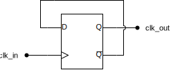

= Flipping And Flopping Our Way To Displays
:last-update-label!:
:source-highlighter: highlight.js
:highlightjs-languages: verilog
:revealjs_theme: simple
:revealjs_width: 1600
:revealjs_height: 900
:revealjs_margin: 0.05
:customcss: img/extra.css
:icons: font

== Counters

[.columns]
=== Clock dividers

[.column]

[.column.is-two-thirds]
image:img/dff_div_out.png[width=800px]

=== Scanning

image:img/basys3_7seg_anodes.png[width=900px]

== Lab Overview

=== Block Diagram

image:img/lab_block_diagram.drawio.svg[width=800px]

=== Driving Segments

image:img/basys3_7seg_segment.png[width=900px]

=== Video Demo

[.stretch]
video::4SU6DP_Tv3Y[youtube]