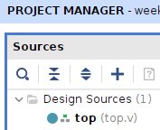
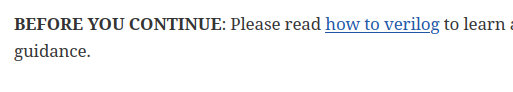
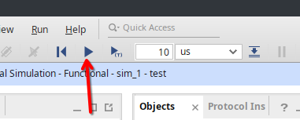

= Deeper Dive on Verilog Syntax
:last-update-label!:
:source-highlighter: highlight.js
:highlightjs-languages: verilog
:revealjs_theme: simple
:revealjs_width: 1600
:revealjs_height: 900
:revealjs_margin: 0.05
:customcss: img/extra.css
:icons: font

== Basics of Verilog Operations

[.compact-table]
include::src/verilog_operations.adoc[]

== Basics of Verilog Modules

[source,verilog]
----
include::src/demo_top.v[tags=basic_module]
----

== The Top File

[source,verilog]
----
include::src/demo_top.v[tags=basic_top]
----

=== Vivado Tips on Top

Make sure that the top file is bolded
and marked with the three blocks

== Ensure to read the "How To Verilog"

Included in this lab is a document on how to read
verilog

== Frequently run Simulation

Ensure to hit "Run All" to finish sim

