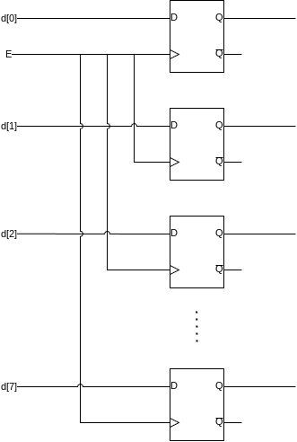
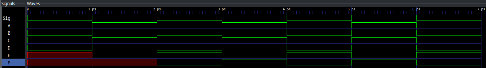

= Making The Circuits Remember
:source-highlighter: highlight.js
:highlightjs-languages: verilog
:revealjs_theme: simple
:revealjs_width: 1600
:revealjs_height: 900
:revealjs_margin: 0.05
:last-update-label!:
:customcss: img/extra.css
:icons: font

[.columns]
== Continuous Assignment

[.column]
* Continuous assignment always happens
* Cannot "wait" for an event
* Cannot "remember" the past

[.column]
[plantuml]
....
include::img/current_state.puml[]
....

[.columns]
== Synchronous Logic

[.column]
* Happens on certain events
* Signals the output is _synchronous_ to
* Contains memory

[.column]
[plantuml]
....
include::img/synch_state.puml[]
....

[.columns]
== The SR-Latch

[.column]
* Basic form of memory
* Uses combinatorial loops
* Should be implemented using behavioral verilog
* Careful of invalid state!

[.column]
image::img/sr_latch.drawio.png[width=600]

=== Truth Table and Considerations

include::src/sr_latch_truth.adoc[]

=== Structural Implementation

[.mid-code]
[source,verilog]
----
include::src/structural_sr_latch.v[tag=module_source]
----

=== Behavioral Implementation
[.mid-code]
[source,verilog]
----
include::src/behavioral_sr_latch.v[tag=module_source]
----

<1> Note the use of continuous assignment here
<2> Synchronous only to Set and Reset
<3> Non-blocking assignment

[.columns]
== The D-Latch

[.column]
include::src/d_latch_truth.adoc[]

[.column]
[plantuml,width=600px]
....
include::img/d_latch.puml[]
....

[.notes]
--
* Synchronous to Enable (E)
* Stores value at D into SR-Latch
* Prevents invalid state
--

[.columns]
=== Making Higher Order Memory

[.column]
* Enable lines tied together
* One D-Latch per bit
* Outputs as a vector

[.column]

[.columns]
=== Making Computer Memory

[.column]
* More than one value!
* Address line selects which to read/write
* Can change switches and only save when button pressed

[.column]
image::img/block_diagram.drawio.png[]

[.columns]
=== How it Should Work

[.stretch]
video::6819vS2GoIY[youtube]

== New Syntax

* Array Syntax
* Demultiplexer
* Loop, `genvar`, and `parameter`

[.columns]
=== Array Syntax

[.column]
<1> Vector: 8 bits
<2> Array, four 1 bit signals
<3> Array of vectors, four 8 bit signals

[.mid-code]
[.column]
[source,verilog]
----
include::src/arrays.v[tags=module_source;!*]
----

[.columns]
=== Array Syntax, Pt. 2

[.column]
<1> Grab one 1 bit signal
<2> Grab one 8 bit signal
<3> Grab one 8 bit signal, then the 8th bit

[.column]
[source,verilog]
----
include::src/arrays.v[tags=access_example]
----

[.columns]
=== Demultiplexer

[.column]
<1> We change on `data` or `sel`
<2> Concat into structured assignment, other outs need to be 0

[.big-code]
[.column.is-two-thirds]
[source,verilog]
----
include::src/demultiplex.v[tags=module_source]
----

[.columns]
=== Loop, `genvar`, and `parameter`

[.column]
<1> Declare `genvar`
<2> `generate` block
<3> For loop! no `++`
<4> Regular declaration
<5> Genvar can be used in assignment
<6> Parameter in instance list

[.column.is-two-thirds]
[.big-code]
[source,verilog]
----
include::src/genvar.v[tags=module_source]
----

[.columns]
=== Instantiating Parameters

[.column]
<1> Passed in before module name

[.column]
[.big-code]
[source,verilog]
----
include::src/genvar.v[tags=module_instance]
----

=== Blocking vs. Non-blocking

[.big-code]
[source,verilog]
----
include::src/block_nonblock.v[tag=module_source]
----

=== Blocking vs. Non-blocking Output

