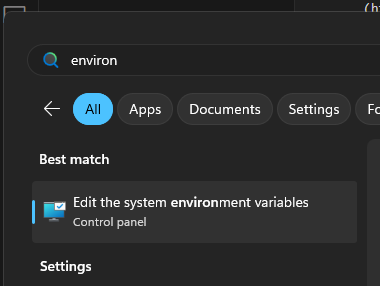

== Windows Installation instructions

xref:index.adoc[Back]

This document covers installing the recommended software on a Windows
device. There are two main ways to do this: The easy way and the good
way.

=== The Easy Way

Download the Icarus Verilog installer from:
https://bleyer.org/icarus/[here]. Then, download and install
https://www.python.org/downloads/windows/[Python]. If you want a more
streamlined way to do these things, look into
https://learn.microsoft.com/en-us/windows/package-manager/winget/[WinGet]
which is an absolutely excellent command line tool to install/update
Windows software.

If using winget, you can simply run the following commands in a
powershell terminal:

....
winget install Icarus.Verilog
winget install Python.Python.3.12
....

==== Optional:

To actually run these things properly from the terminal, you will want
to add Icarus Verilog and GTK Wave to the system PATH. If you do not, it
will not stop you from running tests. The python scripts know where
these tools are installed and will automatically find them.

. Search for `Edit the system environment variables` +

. Select the `Environment Variables` button +

. Double click `Path` under System Variables: +

. Hit `New` and add in the two following paths: `C:\iverilog\bin` and
`C:\iverilog\gtkwave\bin` +

Restart any open shell sessions (sometimes need a full system reboot),
and you should now have access to `gtkwave` and `iverilog` commands.

=== The Good Way

Install https://learn.microsoft.com/en-us/windows/wsl/install[WSL2].
This is generally just a great idea. This gets you access to the
excellent developer resources only available on Linux. Then, you can
install all of those tools with the Ubuntu package manager.

Then, just follow link:linux_install.md[Linux installation]
instructions. You can now launch the WSL window in the repo and use full
featured linux to run the tests and do development.
