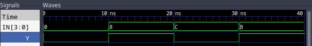
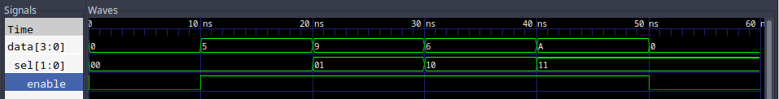
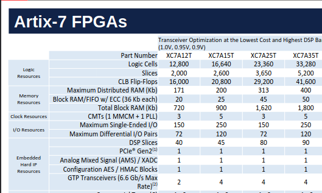
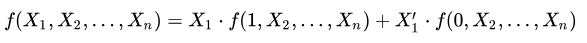
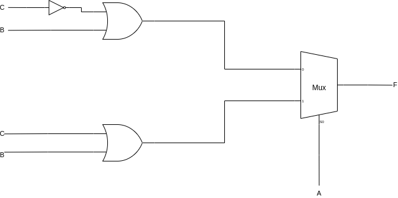

= Behaving Properly
:source-highlighter: highlight.js
:highlightjs-languages: verilog
:revealjs_theme: simple
:revealjs_width: 1600
:revealjs_height: 900
:revealjs_margin: 0.05
:customcss: img/extra.css
:icons: font

== Problem Statement

[.big-code]
[source,verilog]
----
include::src/problem.v[lines=3..20]
----

[.columns]
== State of Affairs

[.column]
* So far we have been using structural verilog
* And continuous assignment

[.column]
[source,verilog]
----
include::src/structural.v[lines=3..11]
----

=== Output

[.columns]
== Solution: Behavioral Verilog

[.column]
<1> Note use of `reg`
<2> Always block
<3> We can use `if`!
<4> and `case/switch`!
<5> No `assign`

[.column.is-three-fifths]
[.mid-code]
[source,verilog]
----
include::src/behavioral.v[lines=3..24]
----

=== Output

[.columns]
== But Why, Though?

[.column.is-three-fifths]

[.column]
* Think of as a higher level language
* Allows synthesis tools more room
* Optimizations using hardened blocks

[.columns]
== Today's Lab

[.column]
* Shannon's Decomposition
** AKA: Boole's Expansion Theorem
** 
* Implement a K-Map with Multiplexer

[.columns]
=== Shannon's Decomp: Part 1

[.column]
[.compact-table]
include::starting_truth_table.adoc[]

[.column]
* Notice that there is actually a very distinct breakover point in this truth table
* Cells where A is zero, cells where A is 1
* Can represent as _two separate functions_

[.columns]
=== Shannon's Decomp: Part 2

[.column]
include::a_is_zero.adoc[]

[.column]
include::a_is_one.adoc[]

[.column]
* Neither equation varies with A
* We can reduce to two separate functions
* Now, two two-variable KMaps to solve the equation
** `F1 = (~C | B)`
** `F2 = (B | C)`
* But, how do we easily combine them?

=== Shannon's Decomp: Part 3

[.columns]
=== Shannon's Decomp: Part 4

[.column]
* This can be done as many times as needed
* Eventually, we can decompose any function
into muxes with fixed inputs