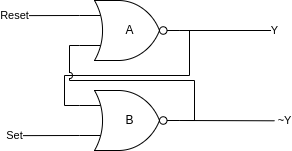
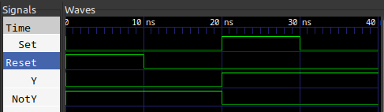

= Synchronous Bitflipping
:source-highlighter: highlight.js
:highlightjs-languages: verilog
:icons: font
:toc:

In this lab we will broach the last foundational topic within RTL and digital logic design -- that of Synchronous Logic. Prior to this, we have only utilized continuous assignment, wherein the output of a circuit immediately reacts to the change in any of its inputs, but this is a very limiting constraint. Everything hereafter will be compositions of structural Verilog, continuous assignment, behavioral Verilog, and Synchronous assignment.

All more complicated digital designs, like that for the CPU in the device on which you are reading this lab, require carefully synchronized changes in the various modules in order to function. And more than that, they need certain values to persist throughout time to be used and reused later. Both of these concepts rely on synchronous logic.

== Synchronous Logic

You deal with synchronous systems all the time. I imagine you've even done so very recently, maybe to log into GitHub and get things ready for this lab -- the login page.

GitHub would be a really poor website if it instantly tried to log you in on every key press, saying "wrong password" each time you entered a character until you finished typing. No -- it *waits* for you to hit the enter key or press the Login button to look at its inputs. That event, either the keyboard or UI, is the synchronous event that triggers the system to operate.

To bring the concept down to the labs/board we have been using, think back to the Multiplexer/Demultiplexer lab, where you had the really crappy "ISP" set up to send data from one of four places to any one of four other places. The CEO, for instance, could not wait to send their data until they had decided on a pattern for the four switches -- that data was always available. And unless you can, in the exact same instant, flip all four switches then intermediary data is making it out on the bus.

See here an example to clarify:

.How it is now
[plantuml]
....
include::img/current_state.puml[]
....

We can see as the CEO is changing the switches, there's a period of time where the wrong values are going out on the bus! In this instance, it is the time highlighted by "Changing", and the values 1 and 5 are not the desired 13.

.How we want it to be
[[how_we_want]]
[plantuml]
....
include::img/synch_state.puml[]
....

So -- how do we get to the state in the second diagram? Well, obviously with synchronous logic (I mean it's even in the title of this section!), but what does that entail?

Well, we have to break the rules we established in week 6 -- we need combinatorial loops! We want to make a light switch we can flip internally in the FPGA, that is an electronically actuated latching circuit. We want to be able to *set* this latch to turn it on, and *reset* this latch to turn it off. Perhaps... we should call it the Set-Reset Latch? I should patent this!

Jokes aside, the solution to this is the SR-Latch, or the Set-Reset Latch. It's a circuit that can be set to on, then reset to off. And, what's important to this circuit, is that if both the set and reset inputs are off, it _holds its state_. Let's see what the output looks like below:

[plantuml]
....
include::img/sr_latch.puml[]
....

NOTE: This unknown state will be a common thing you have to deal with in Synchronous circuits. Before a reset condition, it is physically impossible to know what state a circuit is in. For this reason, we will use reset lines in all of our modules.

What does the circuit that behaves like this even _look_ like? Well, as I hinted, it leverages combinatorial loops:

Here, we have two NOR gates looped together. We will call them A (who outputs Q) and B (who outputs ~Q), and their equations are:

.SR-Latch Equations
====
* `A = Q = Reset NOR ~Q`
* `B = ~Q = Set NOR Q`
====

include::sr_latch_truth.adoc[]

Why and how on earth does this work, though? It seems really simple, and luckily it is. Let's assume, at `t=0` we have `Q=0` and `~Q=1`. This is known as the "reset" case. Let's look through the timeline of events as we assert the "Set" line:

. NOR gate B has inputs of `0 ~| 0` (from Q and Set) which outputs 1 (~Q)
. NOR gate A has inputs of `0 ~| 1` (from Reset and Q~) which outputs 0
. *SET IS ASSERTED*
. NOR gate B now has inputs `0 ~| 1` from Q and Set respectively
. NOR gate B deasserts its output
. NOR gate A now has inputs of `0 ~| 0` (from Reset and Q~) and asserts its output (Q)
. NOR gate B now has inputs of `1 ~| 1` (from Q and Set) and remains deasserted
. *SET IS DEASSERTED*
. NOR gate B now has inputs of `1 ~| 0` (from Q and Set) and remains deasserted
. Circuit has reached a stable state

We can see from the flow above that asserting Set then deasserting it leaves the circuit flipped -- its Q output remains high and ~Q is now low. More importantly, it will remain this way until you toggle the Reset line. This circuit can store a value without needing its inputs to remain active at all times. The outputs Q and ~Q are _synchronized_ to Set and Reset.

== How to Make It

If you were to go ahead and try to implement the above circuit by literally typing:

[source,verilog]
----
include::src/structural_sr_latch.v[tag=module_source]
----

It will simulate in Icarus Verilog and GTKWave will show you what looks to be the correct output:

Notice how `NotQ` and `Q` remain latched even after the inputs go back to zero? This is memory! The SR-Latch is remembering its state without the inputs needing to remain present. This unlocks very significant and exciting behaviors.

However, if you try to implement this circuit using Vivado and synthesize it for the Basys3, you will run into the same problem as Lab 6 -- where it errors out about the combinatorial loop and will not let you proceed.

Thankfully, we have our answer in Behavioral Verilog! Now comes the explanation of `reg` from last lab. We saw that in order to assign values in Behavioral Verilog, we had to add the `reg` keyword to the declaration as well as omit `assign` from the assignment. We do all that because when in behavioral mode, circuits _can generate memory_, which is exactly what our SR-Latch here is.

In the case of Verilog, `reg` means Register. Usually, these types synthesize to use flip-flop or register hardware on the device, but in the case of `pass:[always @(*)]` blocks, they can even contain regular continuous assignment wherein no memory is needed. It is just for silly syntax reasons we *must* use `reg` inside of an `always` block... always.

So, let's rewrite our SR-Latch like the Verilog Gods intended:

[source,verilog]
----
include::src/behavioral_sr_latch.v[tag=module_source]
----

<1> Notice, we can do something really cool here. I can use some structural continuous assignments to mimick the behavior of the inverted output. It is totally valid, and even common, to mix structural and behavioral Verilog in designs.

This will now _behave_ the same, but synthesize correctly in Vivado. However, we have a problem with this design. What if we assert both Set and Reset? Obviously, functionally speaking this has no meaning. How are we supposed to derive the output state given this? The state where Set and Reset are high is known as the "invalid" state of the SR-Latch.

== Where to Go From Here

Obviously, the SR-Latch isn't the end-game of memory and synchronous logic. I thas that "invalid" state mentioned above. How do we stop this? The solution to any digital logic problem is always more digital logic. We need to design an interface to the SR-Latch that _cannot_ be in the invalid state. This could take many forms, but in today's lab, we are going to focus on the D-Latch. It has the following truth table:

include::d_latch_truth.adoc[]

Or, presented as a waveform:

[plantuml]
....
include::img/d_latch.puml[]
....

Notice how the outputs of Q and ~Q only change when E goes high. This circuit is _synchronous_ to E only, rather than to both S and R as the SR-Latch is. It is impossible to get this into an invalid state.

== Lab Deliverables

Your mission, should you choose to accept it (note: enrollment in this class is implicit acceptance), is to implement the D-Latch in Behavioral Verilog using the below IO table:

|===
| Signal | Purpose | Direction
| sw[0]  | D       | IN
| btnC   | E       | IN
| led[0] | Q       | OUT
| led[1] | ~Q      | OUT
|===

NOTE: The D-Latch should be implemented as a set of additional logic that feeds into an SR-Latch, controlling the S and R lines.
