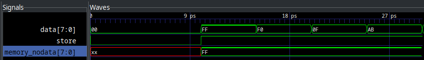
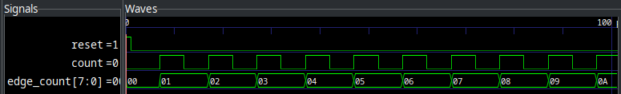
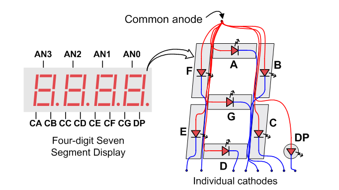

= Counters and State Machines
:source-highlighter: highlight.js
:highlightjs-languages: verilog
:icons: font
:toc:
:stem:

xref:class.zip[Download Class Materials]

== Introduction

During this lab we are going to extend on what we learned about synchronous logic and memory and learn about clocked circuits and state machines. We will narrow the focus on what it means to be synchronous to an event as well as learn how to use memory to drive complex behaviors in computer systems.

== Clocks, Edges, and Flip-Flops Oh My!

In last week's lab, we covered making circuits only change their output when certain signals were high. This meant those circuits were synchronous to whatever signal enabled them to change, usually a signal called `Store` or `Enable`. However, you can go even further, and we will in this lab. As an example, let's revisit the 8 bits of storage we wrote last lab, and take a look at some of its behavior:

[source,verilog]
----
include::src/byte_storage.v[tag=module_source]
----

It outputs:

[[dlatch_out]]
.D-Latch Output
image::img/dlatch_output.png[]

Notice how as long as `store` is asserted, memory changes along with data? Depending on the requirements of your circuit, this could be super sub-optimal. It is more like a door that opens and lets whatever signal come in rather than a snapshot in time. This is of course useful in certain situations, but detrimental in others. In other words, we want to go from a *level sensitive* circuit to an *edge sensitive* circuit. See the image below for clarification:

.Edge vs. Level Sensitivity
[plantuml,format=svg]
....
include::src/level_vs_edge.puml[]
....

The `Level` state is a level sensitive circuit. The `Edge` state is a edge sensitive one. We can see here, that just like the D-Latch we learned last week, they both ignore the `D` input while `E` is low. The big difference shows _while_ `E` is high. Look at the time between 15 and 20, where `E` is high. We can see that the moment it goes high, both `Level` and `Edge` latch in the value. However, while `E` is high and `D` goes low again, the level sensitive circuit follows, while the edge sensitive circuit remains at the value that happened exactly when `E` went high.

This is what we mean by level sensitive and edge sensitive. Level sensitive memory stores the input value _as long as_ its enable signal is high. An edge sensitive one stores the input value _only_ when the enable transitions from low to high -- the edge. We can see this level sensitive behavior in our D-Latch from last week above: <<dlatch_out>>.

What circuit are we looking for? How do we get this edge sensitive behavior? In this case, we want to go from a D-Latch to a D-FlipFlop. Silly sounding name aside, this new circuit is exactly our match. Let's dive in. How do we go about making a circuit that only reacts to signal edges with only regular logic gates? We need a circuit that can act as an edge-detector, and feed that through to the input of the enable or store command of our D-Latch:

.Pulse Detector and D-Latch

And an example of what this output would look like (output of pulse detect elongated for demonstration):

.Pulse Detector and D-Latch Output
image::img/pd_out_example.png[]

In this case, `pd_out` is the output of the pulse detector. It works by delaying and inverting the `store` signal so that we only output 1 from the AND gate for a brief period after the signal goes high. In reality, the width of these pulses with be _much_ lower, I have just shown them elongated for visual effect.

NOTE: See the Verilog source code for this module and its simulation in <<pd_sim_src>>.

If you've gone and looked at the source code for how to write this, you'll see it's cumbersome and not behavioral at all. So how do we convey this in a more behavioral way? Well... why don't we just remove `data` from the sensitivity list? If the logic in the always block is only supposed to evaluate when the signals in the sensitivity list change, that'll surely fix it. Let's take a look at the simulation output from this change:

[source,verilog]
----
include::src/byte_storage.v[tag=changed_sensitivity_list]
----

Holy cow! That fixed it. There's a huge _but_ attached to this, however. Let's run implementation on this and see what Vivado generates as the circuit:

.Uh oh, those aren't flipflops
image::img/wrong_implementation.png[]

Huh. Those are regular D-Latches, not D-Flipflops. You will see this in part 1 of the lab -- the simulation and actual implementation will differ quite strongly in their behavior. Don't blindly trust the simulations!

Thankfully, there is actually a method for doing this in behavioral Verilog. We are trying to get a block to be sensitive to the rising edge of our store signal, and for this you can use the keyword `posedge` in the sensitivity list:

[source,verilog]
----
include::src/byte_storage.v[tag=with_ff]
----

And now, if we implement this in Vivado, let's see what the synthesis tools give us...

.Ah, now *that* is a FlipFlip!

Notice now how the blocks have a `C` pin marked with a `>` -- that means these are clocked _edge triggered_ flip flops rather than level triggered latches as we saw in the previous implementation screenshot. These should now actually behave as flip flops. Also notice the `R` pin -- that's a reset. Allows the circuit to be reset to a `0` state by asserting that value. We will be including this on all circuits from here on out as well.

=== OK, So What is the Point?

What can we do with these new edge triggered circuits? Well, really, implement the rest of all of computer science for a start. All real computer memory systems are based off of what are called *clocked circuits*. Let's start with discussing clocks, as from here on out in our labs we will primarily be utilizing them.

A clock is any digital signal that toggles at a (usually) fixed frequency. That is, every N seconds, it switches from HIGH to LOW or vice versa. You can think of this like the tick of a metronome for a musician, or the synchronizing hands of the Orchestra's Conductor. It is a reliable signal that gives the entire circuit synchronous edges that can drive all amounts of complex behavior.

Let's start with a simple example of something you cannot do with level triggered logic -- counting. Let's say we want to design a circuit that adds 1 to a value each time the clock triggers. Trying with level sensitive circuitry might look like this:

.Level sensitive counter
[source,verilog]
----
include::src/counter.v[tag=level_counter]
----

If we try to simulate this, or implement this, we will run into a problem, though. Vivado (and any other synthesis tool) will implement this using D-Latches and an 8 bit adder:

.Level Sensitive Counter Elaboration

If we try to construct a sequence diagram for this, we would get:

. Value is 0
. Adder adds 0 + 1
. Value changes to 1
. Input to adder changes to 1
. Adder adds 1 + 1
. Value changes to 2
. Input to adder changes to 2
. ...

This never resolves. This will just _rapidly_ count as fast as the gates can toggle. _Probably_ not what we intended. This serves as an excellent example for where edge sensitive circuits are extremely effective. If the memory cannot latch in a new value until the next clock cycle, then there is no endless loop of adding.

.Edge Sensitive Counter Elaboration
image:img/edge_sensitive_counter.png[]

Here we can see that Vivado elaborated to 8 D-FlipFlops. In this case, we will only latch a new value into the flip flops on the positive edge of the count signal, giving us this output:

.Edge Counter Output

NOTE: Full implementation of these counters is available in <<edge_level_counters>>

[[flipflop_div]]
=== Using FlipFlops as Clock Dividers

Say we have a D-FlipFlop implementation:

[source,verilog]
----
include::src/dff_divider.v[tag=dff_impl]
----

And we hook its `NotQ` output into its `D` output, like so:

image:img/dff_div_diagram.drawio.svg[]

Then we can do the following:

image:img/dff_div_out.png[]

Notice how the `Q` output (or `clk_out` in the diagram) toggles at half the rate of the input clock. We can keep chaining these dividers until we divide the input clock by 2^N^ where N is the number of chained FlipFlops. In the case of the Basys3, we have a 100 MHz clock input baked onto the board. We want this to become an approximately 1 KHz signal (or ~1000 times per second) in order to drive each segment on the display for about one millisecond.

Let's examine our options:

stem:[100e^6 -: 2^N ~= 1000]

With N = 16, we get ~1526 Hz and with N = 17 we get ~763 Hz. Given that we want each segment to be lit for between 1 and 4 milliseconds, the better choice is N = 17. This will give us an output clock frequency that is adequate to drive a scanner for the seven segment displays.

=== Using Counters as Clock Dividers

If you require a much more precise clock frequency that you can't do by doing the FlipFlop divider, then you can go the more costly route -- using counters as dividers. We saw in a previous section how to create a simple circuit that just counts up. We can use this with some supporting circuitry to generate a much wider array of more precise frequencies out of our input. Let's look at an example.

Let's say we wanted to do _exactly_ 1000 Hz out of our 100 MHz input:

stem:[frac{100 MHz}{X} = 1000 Hz => X = frac{100 MHz}{1000 Hz} => X = 100e^3]

However, 100,000 is not a power of 2. So we can't do it with any whole number of FlipFlop dividers. What we can do, however, is generate a new clock with the output of a counter. First, we need to determine how many bits our counter needs to represent out target divisor:

stem:[ceil(log_2(100e^3)) = 17 bits]

We could then set up a circuit at the output of our counter that detects the 100,000 case, triggers an output, then resets the counter. This is very simple with behavioral verilog:

[source,verilog]
----
include::src/count_divider.v[tag=divclock_impl]
----

As you can see, we simply watch for the output of our divider to be 100,000 and toggle our output clock based on that, resetting the underlying counter. This, while it might initially seem like a better option than the 2^N^ divider, uses far more gates:

.Counter Divider Schematic

The highlighted block is a ton of gates and a large usage -- it is the section of logic that compares the current count to 100,000 and is the main reason to avoid this system if you can. If your output clock requirements are relatively loose, always go with the 2^N^ divider.

[[displaying]]
== Displaying Our Count

To add some fun to this lab, we are going to visualize things with the Seven Segment display for the first time! It is wired up as a common anode, switched cathode style. See below:

NOTE: For much more detail on this and other things about the Basys3, see xref:https://digilent.com/reference/programmable-logic/basys-3/reference-manual#seven_segment_display[the reference manual]. The following two images are from this web page.

.Common Anode (source: Digilent Reference Manual)

.Segment Selection (source: Digilent Reference Manual)
image:img/basys3_7seg_anodes.png[]

In order to use the displays, we need to select the digit we want to display, then drive the segments we wish to display for that digit. Each digit needs to be on for somewhere near 1 millisecond in order for persistence of vision to make it appear as if they are all on at the same time. Much faster than that and the LEDs within the displays don't have enough time to light, and much slower than that and you can start to see it turning on individual segments. It is worth noting that all logic for the Basys3 Seven Segment is inverted -- 0 is ON and 1 is OFF.

For instance, to display an A on the right-most segment, we would want to do the following:

- Set AN3, AN2, AN1 to 1 (HIGH is off for anodes)
- Set AN0 to 0 (LOW is on for anodes)
- Set segment D to 1 (HIGH is off for segments)
- Set segments A, B, C, E, F, G to 0 (LOW is on for segments)

This would turn off the other three segments and illuminate an A character on the right-most segment. You could imagine creating a decoder that takes in a four bit number and decodes it into the hex digit set: 0 - F and using it to display any number you wanted. I wonder where that leads us...

== Lab Deliverables

In this lab, we will be building a system that displays the output of a simple set of math operations onto the seven segment displays on the Basys3 board. See the block diagram below:

You will need the following components:

. Clock divider to generate an approximately 1KHz signal for the 7seg Scan
. A demultiplexer that selects the Anode of a single 7seg display
. Four decode block that turn a four bit number into 7seg digits (one per digit)
. A math block to add A + B
. A math block to do A - B

The following table describes the meaning of each segment:

|===
| Segment | Purpose | Signal
| L       | A - B   | an[3]
| LC      | A + B   | an[2]
| RC      | B       | an[1]
| R       | A       | an[0]
|===

=== Part 1: Generating clock signal

NOTE: For this, refer to the sections above (primarily <<flipflop_div>>) about creating clock dividers.

Create a simple module that takes in the 100 MHz clock integrated into the Basys3 board and generates an approximately 1 KHz signal out. If you feel like going the extra mile, you can go ahead and make it precisely 1 KHz output. See the following code segment for scaffolding:

[source,verilog]
----
include::src/scaffolding.v[tag=clock_div]
----

=== Part 2: Writing the segment scanner

NOTE: For this, refer to <<displaying>> for more information.

This component will need to take in the divided clock and scan through the four segments' anodes. See the following code segment for scaffolding:

[source,verilog]
----
include::src/scaffolding.v[tag=seven_seg_scanner]
----

=== Part 3: Writing the segment decoder

NOTE: For this, refer to <<displaying>> for more information.

This component will need to look at what segment is active and display the correct digit for that segment. See the following code segment for scaffolding:

[source,verilog]
----
include::src/scaffolding.v[tag=seven_seg_decoder]
----

=== Part 4: Writing the math block

NOTE: For this, refer to previous labs for information on the adder/two's compliment

This component will do simple math on two four bit numbers, outputting both A + B and A - B. It is up to you how to implement the addition and subtraction, but we have created four bit adders and subtractors both in previous labs. See the following code segment for scaffolding:

[source,verilog]
----
include::src/scaffolding.v[tag=math_block]
----

=== Part 5: Tying it all together

Finally, the top module. See the following code segment for scaffolding:

[source,verilog]
----
include::src/scaffolding.v[tag=top]
----

[[pd_sim_src]]
== Appendix 1: Pulse Detect into D-Latch Verilog Code

[source,verilog]
----
include::src/pd_dlatch_sim.v[]
----

== Appendix 2: Edge and Level Sensitive Counters
[source,verilog]
----
include::src/counter.v[tags=*]
----